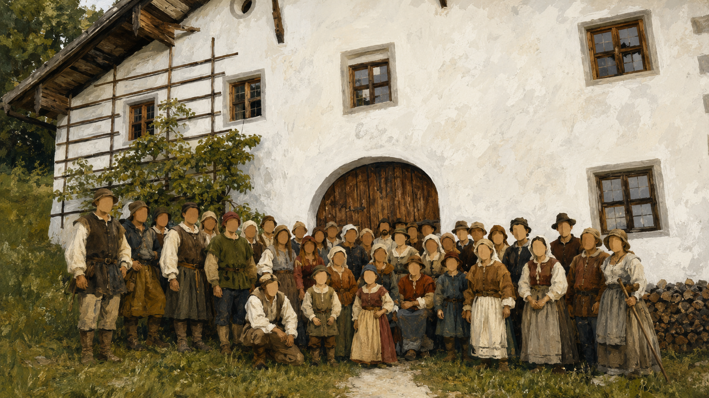
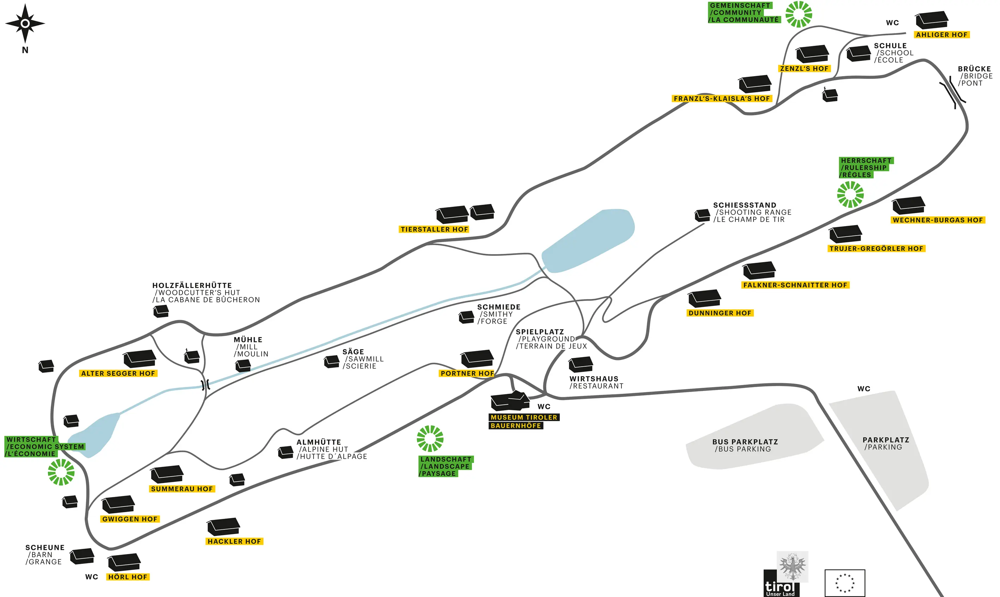
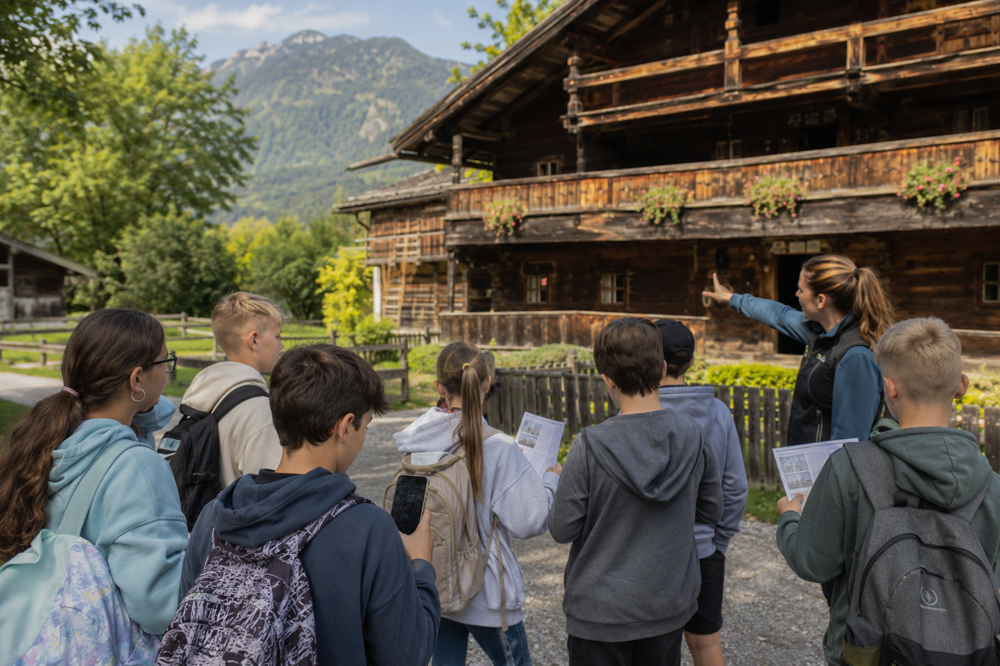
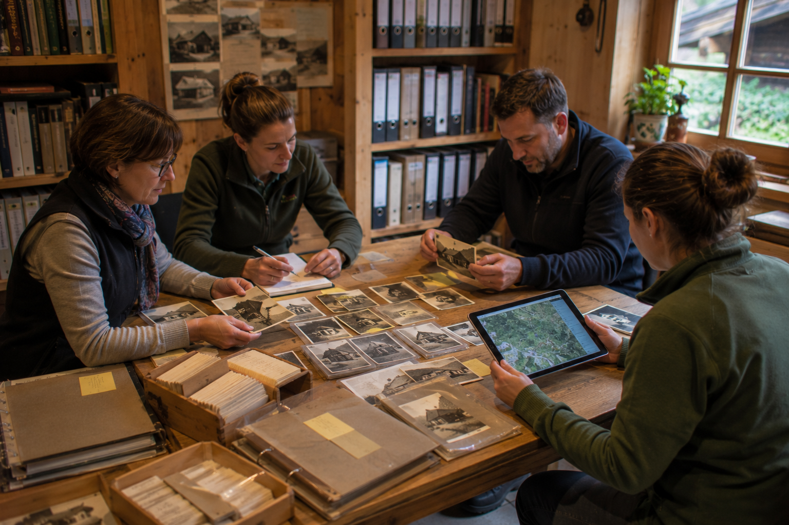
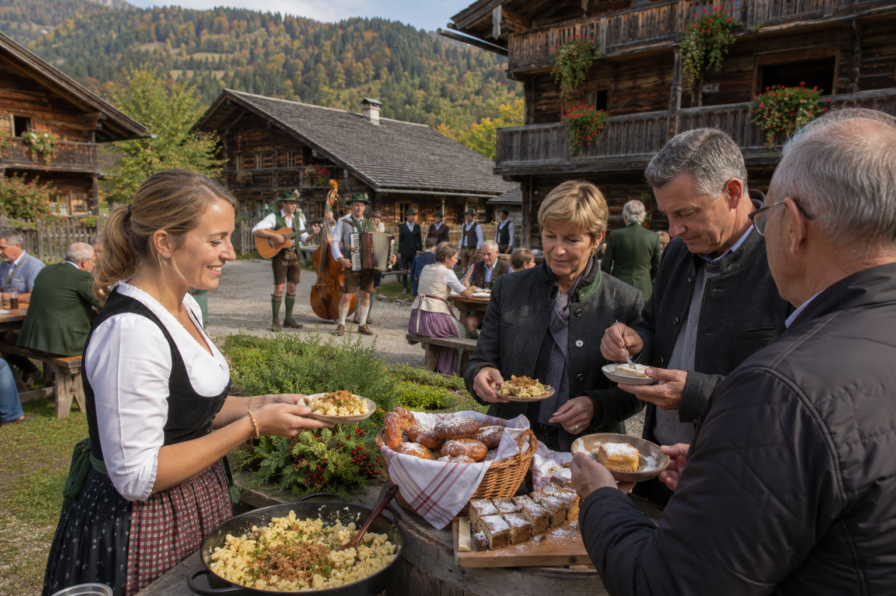

# Hack am Hof - Museumsplattform

Pitchbarer Webapp-/PWA-Prototyp für eine ortsbezogene Erlebnis- und Betriebsplattform rund um das Museum Tiroler Bauernhöfe.

Das Repository knüpft an den AI-Hackathon im Museum Tiroler Bauernhöfe an und führt den entstandenen Projektstand als lauffähige Webdemo weiter.



## Wo einsteigen?

Je nachdem, warum du hier bist, ist ein anderer Einstieg sinnvoll:

- **Nur ansehen:** Öffne die [Webdemo auf GitHub Pages](https://scoinnotec.github.io/aicollective-hack-am-hof/).
- **Ohne Programmiererfahrung mitarbeiten:** Starte mit [ELI5: So funktioniert das Projekt](docs/wiki/ELI5-So-funktioniert-das-Projekt.md) und danach mit dem [Vibe-Coder Einstieg](docs/wiki/Vibe-Coder-Einstieg.md).
- **Mit KI-Tools weiterbauen:** Lies [KI-Tools für dieses Projekt](docs/wiki/KI-Tools-fuer-dieses-Projekt.md), bevor du Codex, Claude, Cursor, Windsurf oder Copilot verwendest.
- **Pitch oder Entscheidung vorbereiten:** Beginne mit [Pitch & Projektlogik](docs/PITCH.md), danach mit [Roadmap und offene Aufgaben](docs/2026-05-25_Hack-am-Hof-Projekt-Backlog.md).
- **Technisch einsteigen:** Lies [Architektur](docs/ARCHITECTURE.md) und starte anschließend lokal mit `npm install` und `npm run dev`.

## Links nach Zweck

### Demo und Projektorte

- [Webdemo auf GitHub Pages](https://scoinnotec.github.io/aicollective-hack-am-hof/)
- [Projekt-Wiki](https://github.com/scoinnotec/aicollective-hack-am-hof/wiki)
- [GitHub-Webprojekt](https://github.com/scoinnotec/aicollective-hack-am-hof)
- [GitHub-Wiki](https://github.com/scoinnotec/aicollective-hack-am-hof/wiki)

### Einstieg für Nicht-Programmierer:innen

- [ELI5: So funktioniert das Projekt](docs/wiki/ELI5-So-funktioniert-das-Projekt.md)
- [Vibe-Coder Einstieg: von null bis zur eigenen Änderung](docs/wiki/Vibe-Coder-Einstieg.md)
- [KI-Tools für dieses Projekt](docs/wiki/KI-Tools-fuer-dieses-Projekt.md)

### Projektsteuerung und Inhalte

- [Pitch & Projektlogik](docs/PITCH.md)
- [Projekt-Backlog](docs/BACKLOG.md)
- [Roadmap und offene Aufgaben](docs/2026-05-25_Hack-am-Hof-Projekt-Backlog.md)
- [Event-Blueprint](docs/EVENT_BLUEPRINT.md)
- [Buildathon-Referenzen](docs/BUILDATHON_REFERENCES.md)
- [Update-Log](docs/UPDATELOG.md)
- [Bildprompts](BILDPROMPTS.md)

### Technik

- [Architektur](docs/ARCHITECTURE.md)

### Kontext und externe Quellen

- [AI Collective](https://aicollective.at)
- [Hack am Hof](https://aicollective.at/hack-am-hof)
- [Offizielle Website Museum Tiroler Bauernhöfe](https://www.museum-tb.at)
- [Museum Tiroler Bauernhöfe bei Wikipedia](https://de.wikipedia.org/wiki/Museum_Tiroler_Bauernhöfe)
- [Museum Tiroler Bauernhöfe im Alpbachtal](https://www.alpbachtal.at/de/entdecke-das-alpbachtal/kultur-und-brauchtum/kulturelle-perlen-der-region/museum-tiroler-bauernhoefe)
- [Museum Tiroler Bauernhöfe bei Tripadvisor](https://www.tripadvisor.at/Attraction_Review-g811449-d3605911-Reviews-Museum_of_Tyrolean_Farmsteads-Kramsach_Tirol_Austrian_Alps.html)

## Was man sieht

Der Prototyp zeigt keine einzelne Museums-App, sondern ein wiederverwendbares System aus Hofpass, Karte, Guide-Wissen, Zielgruppenlayern und späteren Partnerpaketen.



### Kernmodule

| Modul | Bild | Kurzbeschreibung |
| --- | --- | --- |
| Schulklassenmission |  | Hofpass-Pilot mit Rollen, QR-Stationen, Karte, Aufgaben und Abschluss. Danach schrittweise erweiterbar für Familien, Senior:innen, Reisegruppen, Chroniker:innen und weitere Zielgruppen. |
| Guide Studio |  | Guide-Wissen, Quellen, Fotos, Audio und Freigaben werden gesammelt, bevor daraus Missionen entstehen. |
| Foto & Feier |  | Fotospots, freie Trauung, Taufe, Erinnerungsprodukt und Ambassador-Logik. |
| Schmankerl-Route |  | Kulinarik, Hofgeschichten, Rezeptpass, Audio und Abschluss im Gasthaus. |
| Rattenberg-Brücke |  | Kombipaket aus Glasstadt, Museum, Schmankerl, Erinnerungsfoto und planbarer Rückfahrt. |
| Zeitreise Foto |  | Besucher:innen werden Teil einer historischen Hofszene, später mit Druck-/Souvenirprozess. |

Der erste sinnvolle Pilot ist die Schulklassenmission. Dieselbe technische und inhaltliche Grundlage kann danach Schritt für Schritt erweitert werden: für Familien mit kürzeren Runden, für Senior:innen mit ruhigen Wegen, größerer Schrift und Audio, für Reisegruppen mit planbaren Zeitfenstern, für Chroniker:innen mit Quellen- und Erinnerungsarbeit sowie für interne Teams mit Wartungs- und Dokumentationspunkten.

### Weitere Ausbaupfade

- Familienmodus, Pensionistenmodus, Chroniker-Modus und interner Betrieb.
- Bauernhaus-Inspiration für hochwertige Umbau- und Handwerksfragen.
- Kräuterpfad, Living History, Markt und Handwerk, Oldtimer-Tag, VR/AR-Zeitreise und weitere bewusst geparkte Ideen.
- Medien- und Audiofundament für QR-Hinweise, Guide-Joker und spätere PWA-/App-Erweiterung.

## Ziel

Der aktuelle Stand soll vor allem eine kleine, klare Pilotentscheidung ermöglichen:

- eine reale Schulroute mit 4 bis 5 Stationen,
- einen Guide-Studio-Workshop mit Museum, Guides und Verein,
- einen klickbaren Hofpass-Flow mit Rollen, QR-Start, Karte und Feedback,
- erste Partnerpakete als nächster Ausbau, etwa Foto/Feier und Schmankerl-Route,
- klare Trennung zwischen Pilot, nächstem Ausbau und Ideenpool.

## Stack

- React
- TypeScript
- Vite
- Leaflet / React Leaflet
- PWA-Grundstruktur
- statische TypeScript-Daten

## Einstieg für Nicht-Programmierer:innen und Vibe-Coder

Wenn du noch nie mit GitHub gearbeitet hast, starte hier:

1. [ELI5: So funktioniert das Projekt](docs/wiki/ELI5-So-funktioniert-das-Projekt.md) lesen.
2. [Vibe-Coder Einstieg](docs/wiki/Vibe-Coder-Einstieg.md) Schritt für Schritt durchgehen.
3. Projekt mit GitHub Desktop oder `git clone` auf den eigenen Computer holen.
4. Im Projektordner `npm install` und danach `npm run dev` ausführen.
5. Im Browser `http://127.0.0.1:5173/` öffnen.
6. Mit Codex, Claude, Cursor, Windsurf, Copilot oder einem anderen KI-Tool kleine Änderungen machen.
7. Vor dem Hochladen immer `npm run typecheck` und `npm run build` ausführen.
8. Änderungen mit GitHub Desktop oder Git wieder zu GitHub hochladen.

Die Wiki-Quellseiten liegen unter [docs/wiki](docs/wiki/). Sie sind so geschrieben, dass sie auch in das GitHub-Wiki kopiert oder in ein Wiki-Repository übernommen werden können.

### Was Vibe-Coder zuerst verstehen sollten

- GitHub ist der Online-Projektordner.
- `README.md` ist die Startseite.
- `apps/web/src/App.tsx` baut die Hauptseite zusammen.
- `apps/web/src/data/platform.ts` enthält viele Inhalte und Daten.
- `apps/web/src/styles.css` steuert das Aussehen.
- `apps/web/public/pitch-images/` enthält die Bilder.
- `npm run dev` startet die lokale Vorschau.
- `npm run build` prüft, ob eine veröffentlichbare Version gebaut werden kann.

Mehr dazu:

- [Vibe-Coder Einstieg](docs/wiki/Vibe-Coder-Einstieg.md)
- [KI-Tools für dieses Projekt](docs/wiki/KI-Tools-fuer-dieses-Projekt.md)
- [ELI5-Erklärung](docs/wiki/ELI5-So-funktioniert-das-Projekt.md)

## Start

### Für Entwickler

```bash
npm install
npm run dev
```

Dann im Browser:

```text
http://127.0.0.1:5173
```

### Fertige Demo bauen

```bash
npm install
npm run build
```

Danach liegt die fertige statische Demo unter:

```text
apps/web/dist/
```

### Lokal starten für Laien

Nach dem Build kann die Demo ohne Entwicklungsserver lokal gestartet werden:

- Windows: `start-demo.bat` doppelklicken
- Windows PowerShell: `start-demo.ps1` ausführen
- macOS/Linux: `./start-demo.sh` ausführen

Die Startdateien starten einen kleinen lokalen Server unter:

```text
http://127.0.0.1:8088/
```

Voraussetzung für den lokalen Laienstart ist Python. Wenn Python fehlt, zeigen die Startdateien eine verständliche Meldung.

### Online über GitHub Pages

Das Projekt ist für GitHub Pages vorbereitet. Beim Push auf `main` baut die GitHub Action `.github/workflows/deploy-pages.yml` die Webapp und veröffentlicht `apps/web/dist`.

Für das Repository:

```text
https://github.com/scoinnotec/aicollective-hack-am-hof.git
```

muss in GitHub unter `Settings -> Pages` als Quelle `GitHub Actions` aktiviert sein.

## Projektstruktur

```text
apps/web/
  public/
    lageplan.webp
    manifest.webmanifest
    sw.js
  src/
    components/
    data/
    features/map/
    lib/
docs/
  ARCHITECTURE.md
  BACKLOG.md
  EVENT_BLUEPRINT.md
  PITCH.md
  UPDATELOG.md
```

## Prinzip

Der Prototyp startet bewusst lokal und datengetrieben. Später können Datenbank, Admin-Login, KI-Bildgenerierung, echte Uploads, QR-Codes, Offline-Modus und App-Verpackung mit Capacitor ergänzt werden.
