# Hack am Hof - UI/UX Block-Review

Datum: 2026-05-25  
URL: http://127.0.0.1:5173  
Viewport: Desktop, 1280 x 720  
Umfang: 20 Screenshots von oben nach unten

## Kurzfazit

Die Website wirkt hochwertig, ruhig und glaubwuerdig. Sie passt grundsaetzlich gut zu einem Museums-, Bildungs- und Foerderprojekt: warme Bildwelt, klare Typografie, sachliche Struktur und ein kuratierter Eindruck. Der aktuelle Stand liest sich aber an vielen Stellen noch eher wie ein Pitchdeck oder Vorstandsdokument als wie eine fokussierte Produktwebsite.

Die groessten Hebel:

1. **P1: Layoutfehler in Block 19 beheben.** Im Bereich Erweiterungen ueberlagern sich Beschriftungen und Tabelleninhalte sichtbar.
2. **P1: Laenge und Dichte reduzieren.** Besonders Decision, Board-Workflow, Kontext, Buildathon-Tabelle und Erweiterungen brauchen klarere Verdichtung.
3. **P2: Produktbeweis frueher und wiederholt zeigen.** Die staerksten Bloecke sind die App-, Karten- und Prototypenansichten. Diese sollten staerker als roter Faden dienen.
4. **P2: Typografische Hierarchie beruhigen.** Viele sehr grosse Serif-Ueberschriften konkurrieren miteinander.
5. **P2: Wiederholung von beige Flaechen und Kartenraster brechen.** Das Erscheinungsbild ist konsistent, wird aber ueber die lange Seite etwas monoton.

## Screenshot-Uebersicht

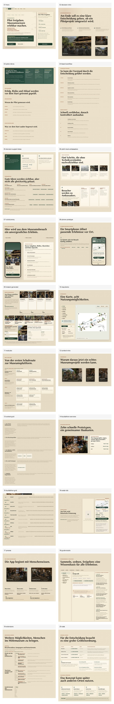

## Prioritaeten

**P1 - Muss vor Praesentation/Freigabe**  
Sichtbare Layoutfehler, Ueberlagerungen, zu hohe kognitive Last in entscheidenden Abschnitten.

**P2 - Wichtig fuer Wirkung und Nutzbarkeit**  
Struktur, Informationsarchitektur, visuelle Gewichtung, Scanbarkeit und Passung zum Produktnarrativ.

**P3 - Feinschliff**  
Microcopy, Details in Abstaenden, Bildzuschnitten, Hover-/Interaktionszustaenden und CTA-Texten.

## 01 - Hero / Einstieg

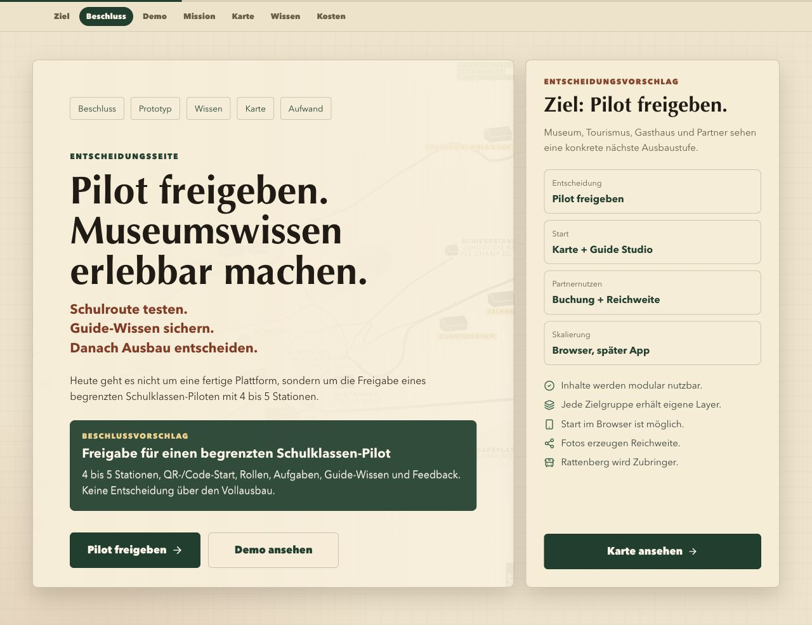

**Bewertung**  
Der Einstieg ist visuell stark und wirkt professionell. Bildsprache, Ton und Farbwelt passen sehr gut zum Museums- und Bildungsprojekt. Die grosse Serif-Typografie gibt dem Projekt Gewicht, allerdings ist die Startansicht sehr pitchartig und weniger produktorientiert. Die beiden rechten Karten sind hilfreich, wirken aber fast gleich wichtig wie die Hauptbotschaft.

**Ueberarbeitungsschritte**

1. **P2:** Headline verdichten und eine klare Hauptbotschaft priorisieren: entweder Pilotfreigabe oder Produkterlebnis, nicht beides gleich gross.
2. **P2:** Primaeren CTA sichtbarer machen, etwa als klarer naechster Schritt fuer Entscheider.
3. **P2:** Rechte Karten staerker differenzieren: eine Karte fuer Nutzen, eine fuer Status/Naechster Schritt.
4. **P3:** Bildausschnitt pruefen, damit der historische Ort noch staerker als emotionaler Anker wirkt.

## 02 - Entscheidungsintro

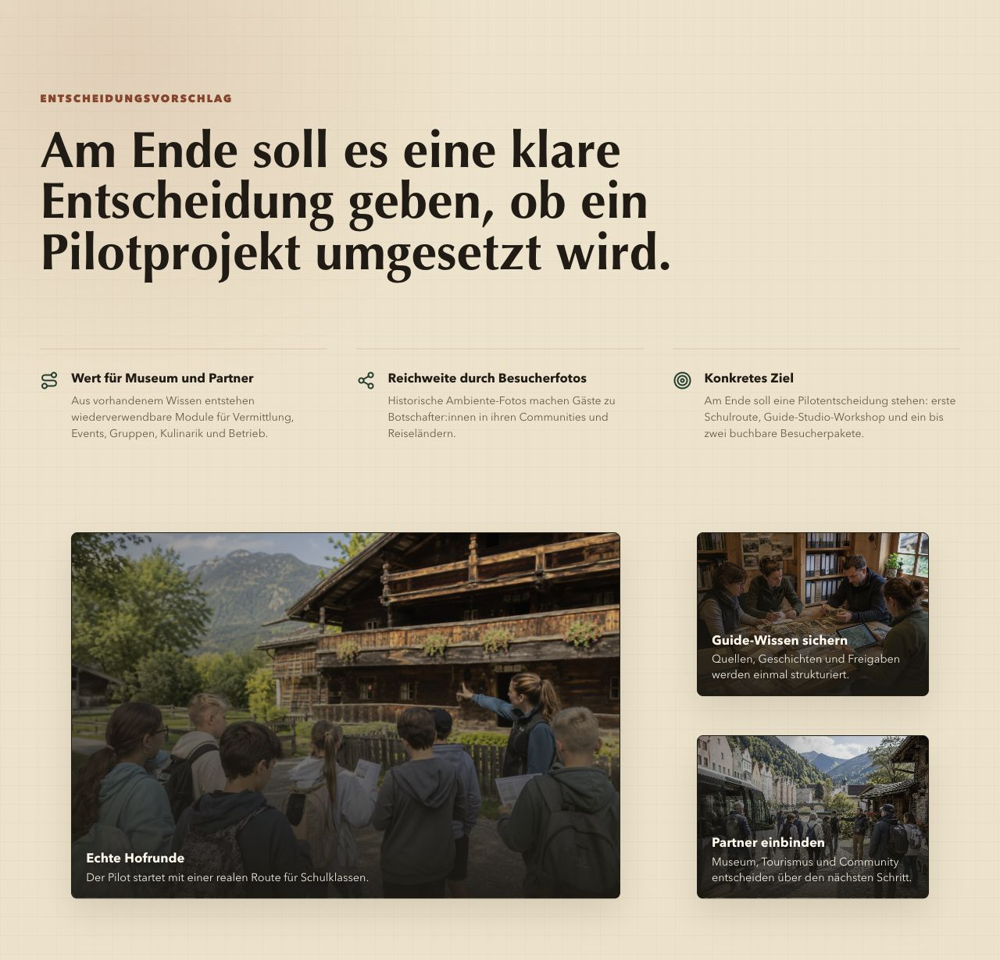

**Bewertung**  
Der Block hat eine passende, ruhige Museumsanmutung und baut Vertrauen auf. Die grossen Bildkarten funktionieren als Atmosphaere, aber der obere Bereich wirkt etwas leer und die Bildkarten bleiben eher dekorativ als argumentativ. Fuer eine Entscheidungsseite fehlt eine schnelle Antwort auf: Warum jetzt, warum dieses Pilotprojekt, warum mit geringem Risiko?

**Ueberarbeitungsschritte**

1. **P2:** Oberen Leerraum reduzieren und die Argumentationsstruktur frueher beginnen lassen.
2. **P2:** Unter die Bildkarten kurze Beweis-Captions setzen, zum Beispiel "Ort", "Zielgruppe", "Pilotnutzen".
3. **P2:** Eine kompakte Entscheidungsbox ergaenzen: Ziel, Aufwand, Ergebnis, Zeitraum.
4. **P3:** Bildhoehen angleichen und Zuschnitte so setzen, dass die Motive aktiver wirken.

## 03 - Pilotkriterien

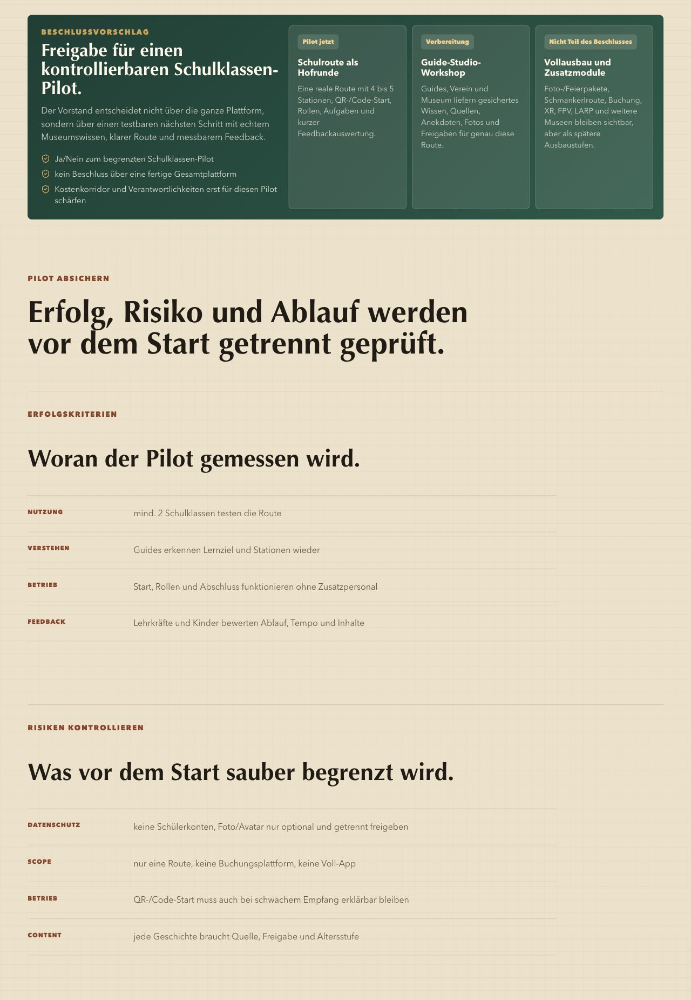

**Bewertung**  
Die Struktur ist sachlich und verstaendlich. Der Block passt gut zum Vorstandskontext, wirkt aber visuell sehr beige und textlastig. Die Kriterien sind relevant, koennten aber schneller scannbar sein. Im jetzigen Zustand muss man viel lesen, bevor der Nutzen klar wird.

**Ueberarbeitungsschritte**

1. **P1:** Kriterien auf maximal 5 bis 6 zentrale Entscheidungskriterien reduzieren.
2. **P2:** Aus langen Textlisten eine Checkliste mit Status/Erfuellungsgrad machen.
3. **P2:** Risiko und Entlastung visuell trennen, zum Beispiel zwei Spalten "Was wird vermieden" und "Was wird gewonnen".
4. **P3:** Mehr visuelle Marker einsetzen, aber sparsam: Haken, Ampelstatus, kleine Kennzahlen.

## 04 - Board-Workflow

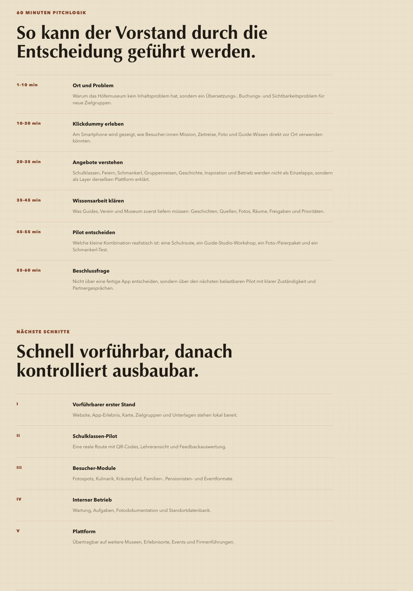

**Bewertung**  
Inhaltlich sinnvoll, aber der Block wirkt am staerksten wie ein Memo. Die lange Tabellen-/Listenstruktur ist fuer eine Website schwer zu erfassen. UI/UX-seitig fehlt ein klarer Blickpfad: Die Nutzer muessen sich horizontal und vertikal gleichzeitig orientieren.

**Ueberarbeitungsschritte**

1. **P1:** Den Workflow in 4 bis 5 Schritte als Stepper oder Timeline umbauen.
2. **P2:** Pro Schritt nur Ergebnis, Verantwortlichkeit und Entscheidungspunkt zeigen.
3. **P2:** Detailtexte in ausklappbare Bereiche oder eine spaetere Appendix-Sektion verschieben.
4. **P3:** Wiederkehrende graue Tabellenoptik reduzieren, damit die Seite weniger dokumentenhaft wirkt.

## 05 - Entscheidungsunterstuetzung / Ideen

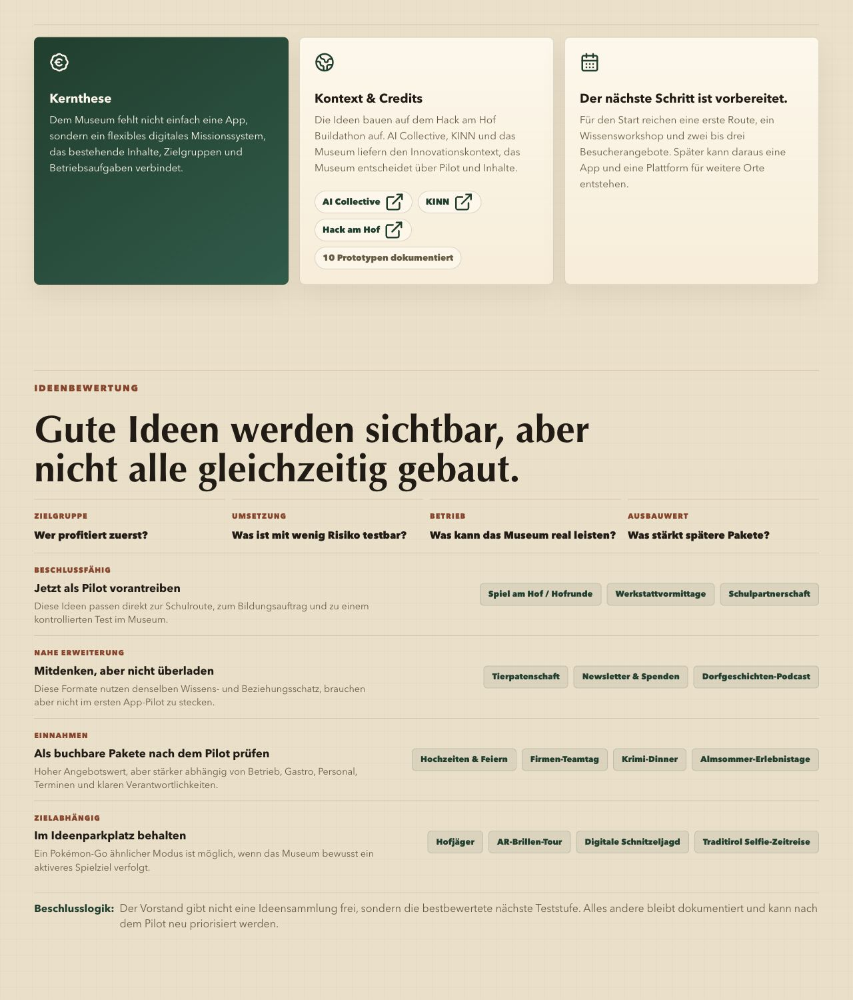

**Bewertung**  
Der Block zeigt gute inhaltliche Substanz und eine sinnvolle Priorisierung. Die Matrix ist nachvollziehbar, aber der untere Bereich wird dicht und chipartig. Die vielen kleinen Elemente schwachen die visuelle Fuehrung.

**Ueberarbeitungsschritte**

1. **P2:** Eine dominante Empfehlung hervorheben: "Pilot sollte X zuerst validieren".
2. **P2:** Matrix auf wenige Achsen reduzieren und pro Feld eine klare Aussage formulieren.
3. **P2:** Untere Chip-Listen gruppieren oder in Tabs aufteilen.
4. **P3:** Beschriftungen kuerzen, damit die visuelle Ruhe erhalten bleibt.

## 06 - Pitch Track / Botschafter

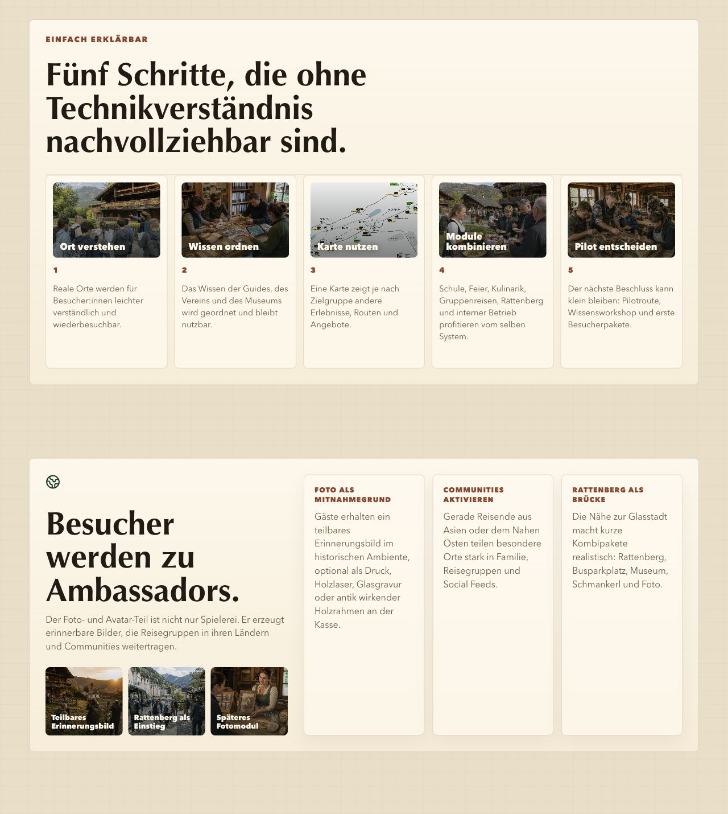

**Bewertung**  
Der Abschnitt passt zur Projektlogik und transportiert Stakeholder-Denken. Gleichzeitig verlaengert er die Pitchdeck-Wirkung weiter. Nach mehreren Strategie- und Entscheidungsteilen sollte hier mehr konkretes Produkt oder Nutzersituation sichtbar werden.

**Ueberarbeitungsschritte**

1. **P2:** Botschafter nicht nur als Rollen zeigen, sondern mit konkreten Nutzungsszenarien verbinden.
2. **P2:** Wiederholte Kartenmuster reduzieren und durch eine kompakte Journey ersetzen.
3. **P2:** Einen sichtbaren Bezug zum Prototyp herstellen: Was sehen diese Rollen konkret?
4. **P3:** Texte weiter kuerzen und Rollenlabels staerker typografisch unterscheiden.

## 07 - Clickdummy

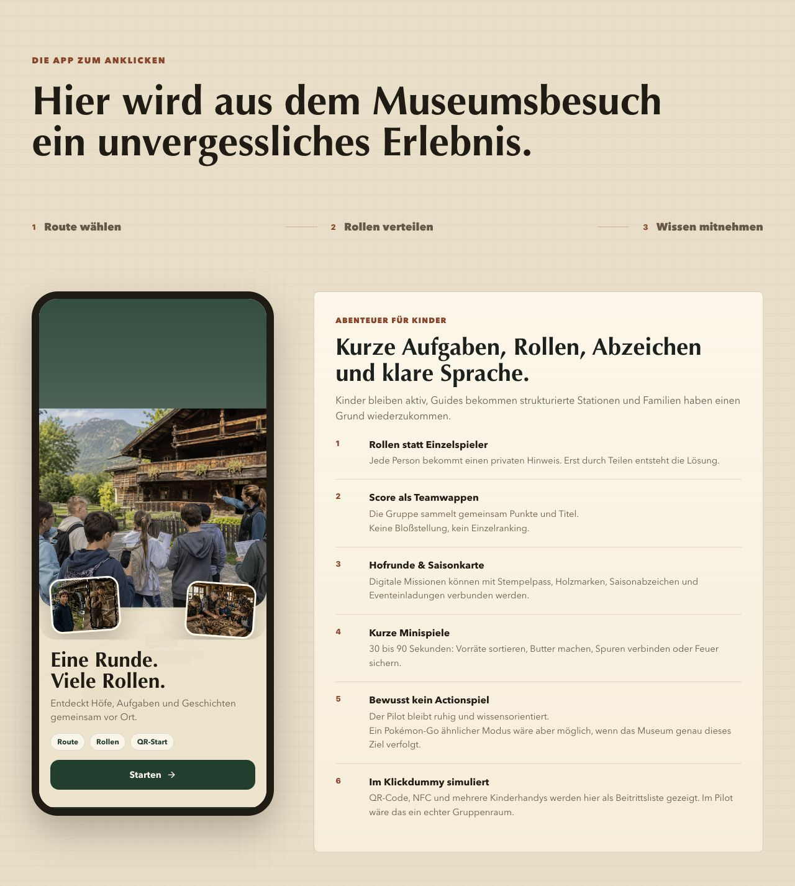

**Bewertung**  
Einer der staerksten Abschnitte. Der Block zeigt endlich konkret, was gebaut wird. Phone-Mockup, App-Screens und erklaerende Karten passen gut zusammen. Die Passgenauigkeit zum Gesamtprojekt ist hoch, weil Museumsort und digitale Vermittlung sichtbar verbunden werden.

**Ueberarbeitungsschritte**

1. **P2:** Diesen Produkttyp frueher auf der Seite anteasern, damit die Website schneller greifbar wird.
2. **P2:** Screens im Phone-Mockup als kleine Sequenz oder Mini-Flow inszenieren.
3. **P3:** Karten rechts auf 3 Kernpunkte reduzieren: Besucherfuehrung, Mission, Auswertung.
4. **P3:** CTA praezisieren, zum Beispiel "Clickdummy pruefen" statt allgemeiner Formulierung.

## 08 - Phone Prototype

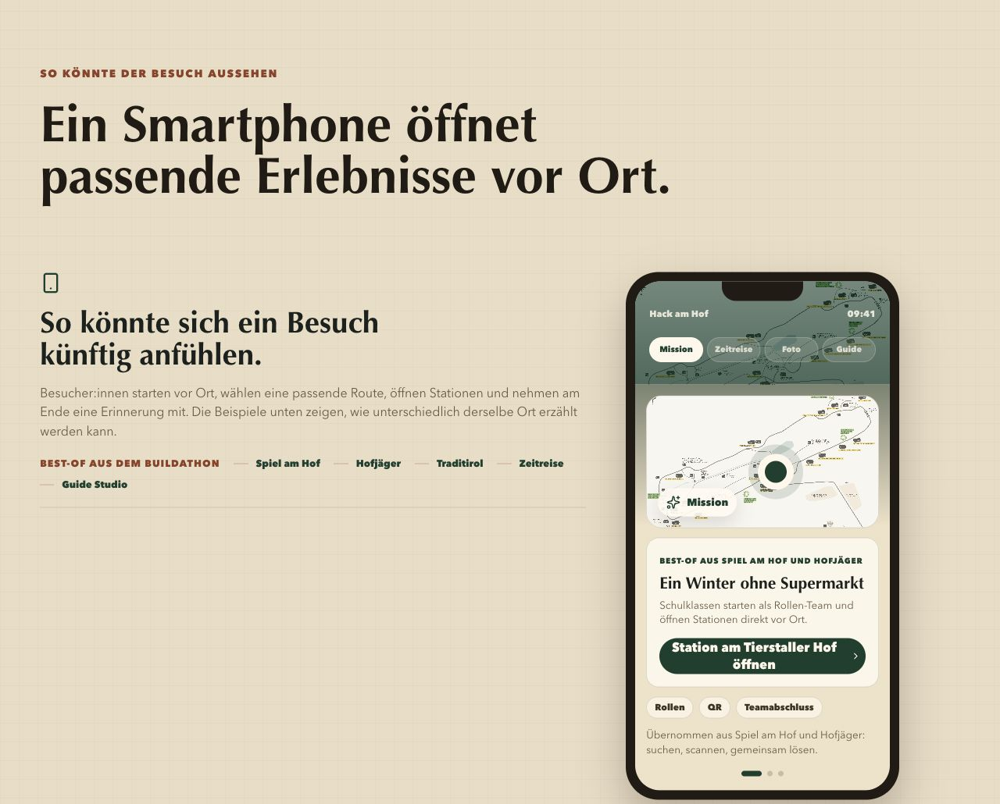

**Bewertung**  
Der Prototypenblock wirkt hochwertig und produktnah. Die starke Phone-Visualisierung hilft enorm. Links entsteht aber viel ruhige Flaeche, waehrend rechts das eigentliche Produkt sitzt. Dadurch wirkt der Block leicht unausgewogen.

**Ueberarbeitungsschritte**

1. **P2:** Linke Textspalte straffen und naeher an den Prototypen fuehren.
2. **P2:** Zusaetzliche App-Zustaende zeigen, zum Beispiel Start, Aufgabe, Fund, Abschluss.
3. **P2:** Eine kurze Aussage ergaenzen, was mit dem Prototyp bereits validiert werden kann.
4. **P3:** CTA und Statushinweis optisch enger an den Phone-Bereich koppeln.

## 09 - Mission Generator

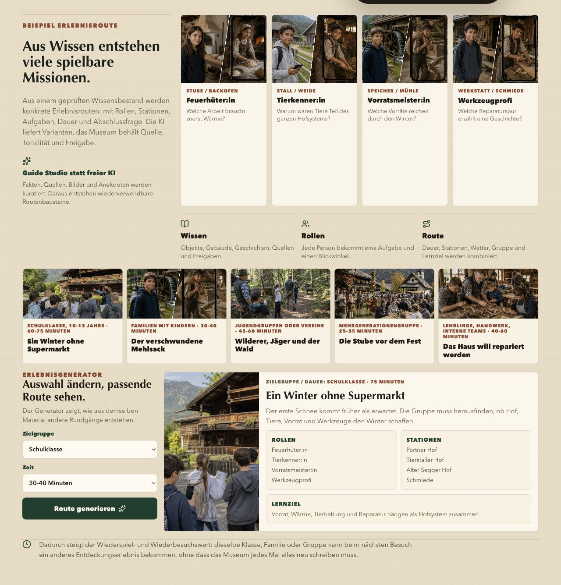

**Bewertung**  
Der Block hat hohe inhaltliche Relevanz und zeigt den didaktischen Kern des Projekts. Gleichzeitig ist er sehr voll. Die vielen Karten, Bilder und Labels konkurrieren miteinander. Fuer Kinder-UX und Museumsvermittlung sollte der Generator spielerischer und leichter wirken.

**Ueberarbeitungsschritte**

1. **P1:** Anzahl sichtbarer Karten reduzieren oder in Tabs/Carousel aufteilen.
2. **P2:** Einen Beispiel-Flow zeigen: Objekt waehlen, Mission generieren, Kind loest Aufgabe.
3. **P2:** Karten hoeherwertig kuratieren: weniger Text, klarere Bildausschnitte, eindeutige Aufgabe.
4. **P3:** Tags und Metadaten optisch zuruecknehmen, damit die Mission im Vordergrund steht.

## 10 - Karten-Demo

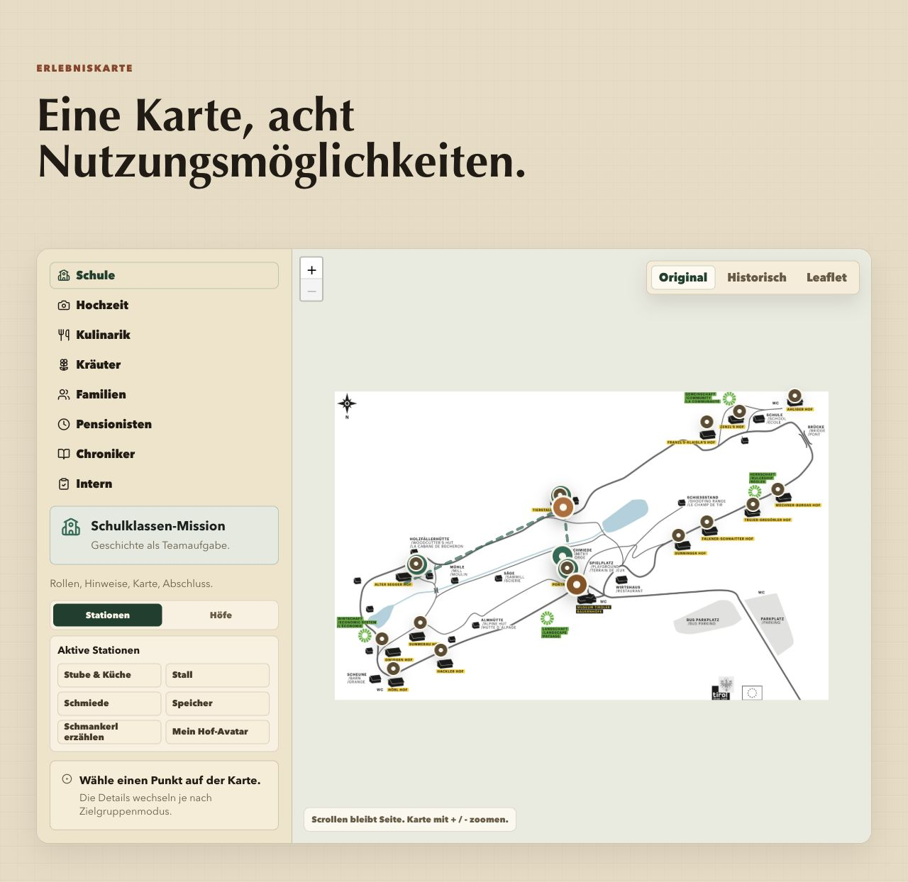

**Bewertung**  
Sehr starker Produktblock. Karte, Missionen und Standortlogik passen hervorragend zum Gesamtprojekt. Der Block zeigt einen echten Nutzen: Besucher bewegen sich durch den Ort und bekommen kontextbezogene Aufgaben. Visuell ist die Sektion eine gute Abwechslung zur langen Text- und Kartenstruktur.

**Ueberarbeitungsschritte**

1. **P2:** Karten-Demo als zentrales Produktbeispiel frueher und prominenter nutzen.
2. **P2:** Einen klaren "Vor Ort"-Use-Case formulieren: Startpunkt, Mission, Rueckmeldung.
3. **P3:** Legende und Seitenpanel weiter verdichten, damit die Karte noch staerker wirkt.
4. **P3:** Mobile Darstellung separat pruefen, weil Karteninterfaces dort schnell eng werden.

## 11 - Module

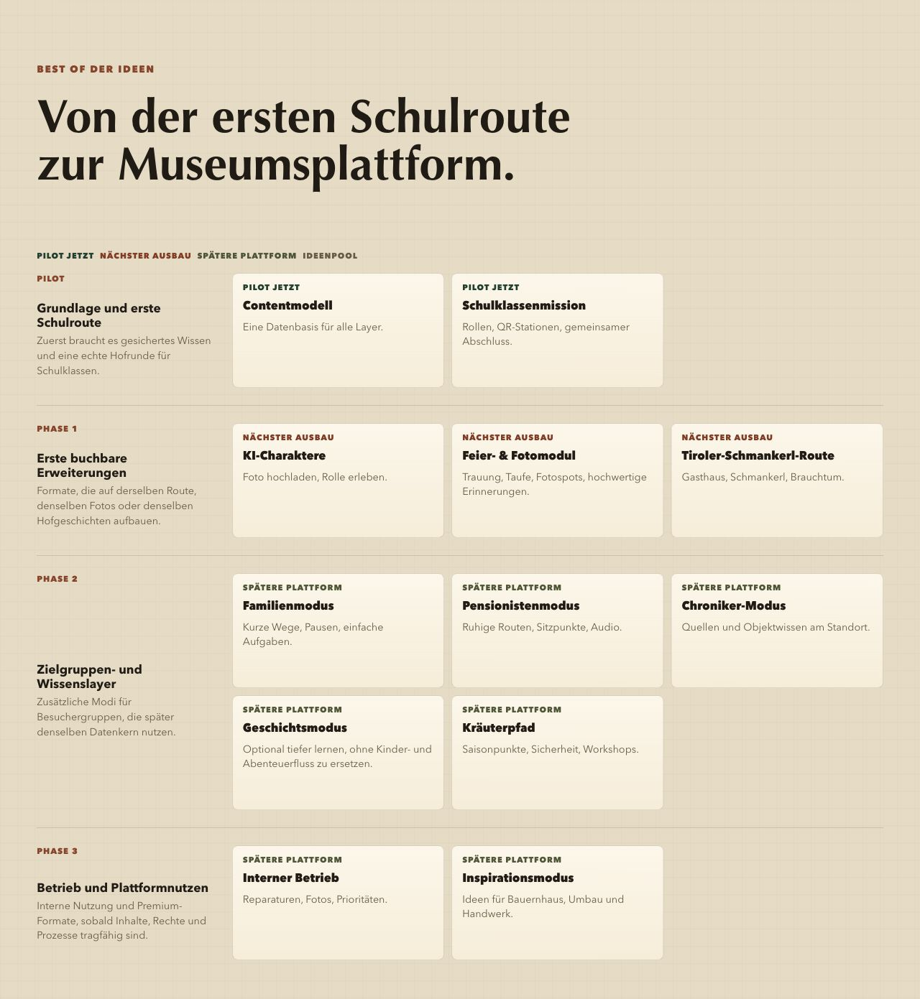

**Bewertung**  
Der Modulbereich ist gut verstaendlich und zeigt Skalierbarkeit. Das passt zur Foerder- und Projektlogik. Visuell ist die Kartenreihe aber sehr gleichfoermig. Nach den vorherigen Abschnitten waere eine staerkere Priorisierung hilfreich.

**Ueberarbeitungsschritte**

1. **P2:** Module in Phasen gruppieren: Pilot, Erweiterung, Betrieb.
2. **P2:** Ein Kernmodul als Startpunkt hervorheben.
3. **P2:** Pro Modul nur Nutzen und Ergebnis zeigen, nicht alle Details.
4. **P3:** Icons oder kleine visuelle Marker einsetzen, um die Karten schneller unterscheidbar zu machen.

## 12 - Kontextintro

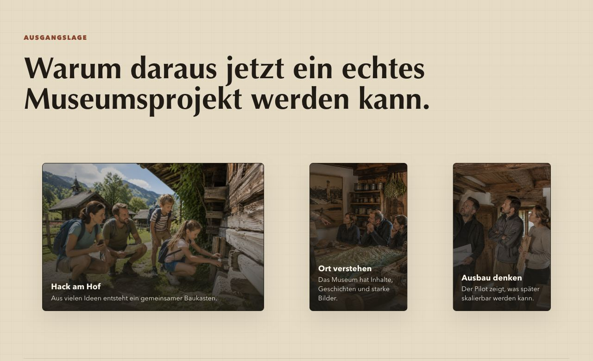

**Bewertung**  
Der Abschnitt bringt den kulturellen und historischen Kontext gut zurueck. Die Bildreihe passt zum Thema, fuehlt sich aber wie ein erneuter atmosphaerischer Zwischenstopp an. Fuer die Gesamtseite ist der Block sinnvoll, sollte aber kuerzer und zielgerichteter sein.

**Ueberarbeitungsschritte**

1. **P2:** Als kurzer Uebergang gestalten, nicht als eigener grosser Themenblock.
2. **P2:** Kontext direkt mit Produktnutzen verbinden: "Aus Ort und Sammlung werden Missionen".
3. **P3:** Bildcaptions staerker auf Erkenntnis statt Beschreibung trimmen.
4. **P3:** Vertikale Hoehe reduzieren.

## 13 - Kontextgrid

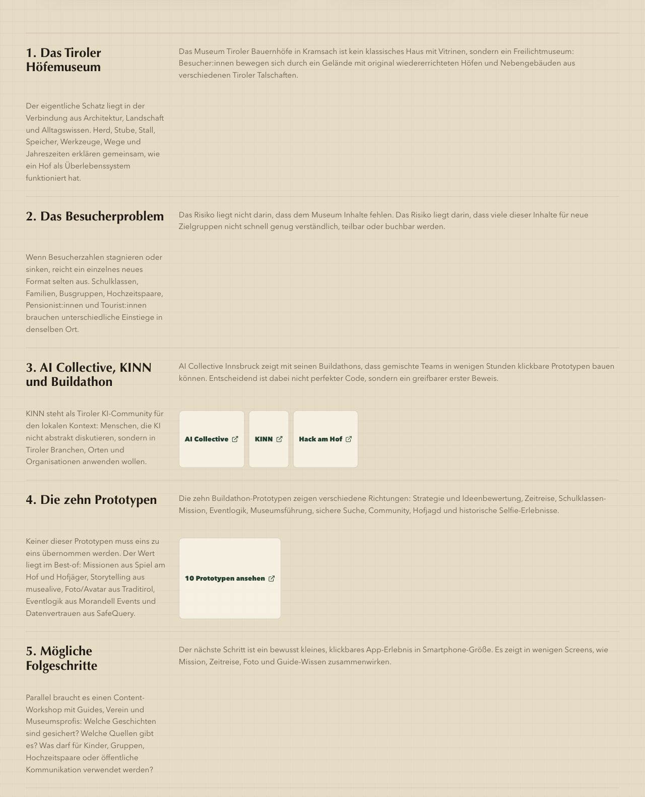

**Bewertung**  
Inhaltlich wertvoll, visuell aber sehr textlastig. Das Grid liest sich wie Recherchematerial. Fuer eine Website ist die Scanbarkeit begrenzt, besonders weil viele Karten ein aehnliches Gewicht haben. Der Bezug zum Projekt ist da, aber nicht immer schnell sichtbar.

**Ueberarbeitungsschritte**

1. **P1:** Kontextmaterial kuratieren: nur die wichtigsten 4 bis 6 Punkte sichtbar lassen.
2. **P2:** Rest als ausklappbares Hintergrundmaterial oder Appendix fuehren.
3. **P2:** Pro Kontextpunkt eine klare Produktuebersetzung zeigen: "Daraus entsteht Mission X".
4. **P3:** Textmengen pro Karte halbieren.

## 14 - Buildathon Uebersicht

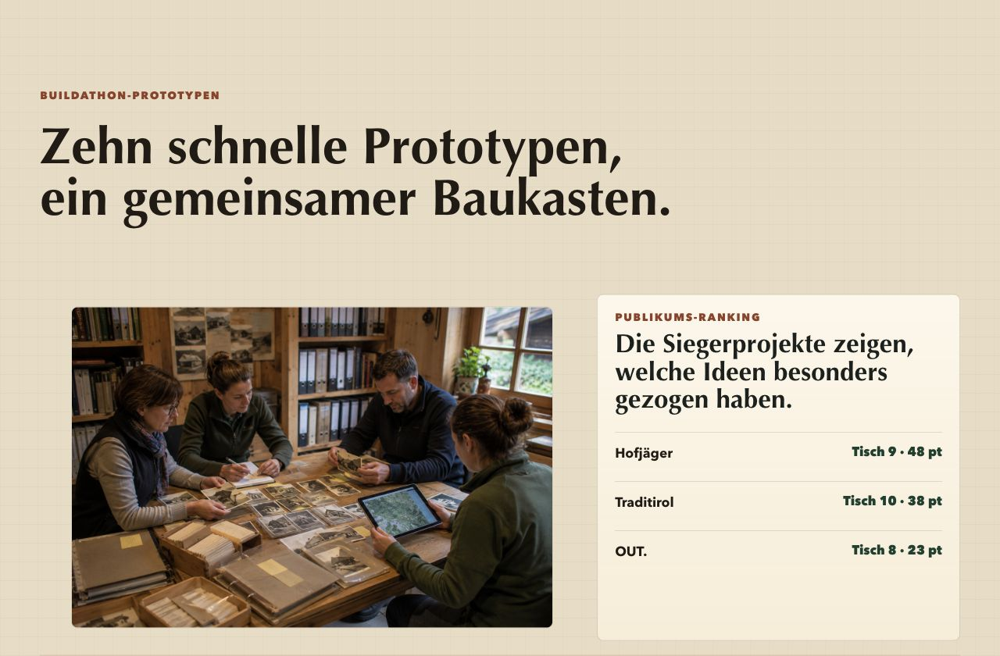

**Bewertung**  
Der Abschnitt belegt Aktivitaet und reale Beteiligung. Das staerkt Glaubwuerdigkeit. Der Zusammenhang zwischen Buildathon und aktueller Pilotentscheidung koennte noch klarer sein. Visuell ist der Block solide, aber etwas breit und ruhig.

**Ueberarbeitungsschritte**

1. **P2:** Klare Aussage an den Anfang stellen: Was wurde im Buildathon validiert?
2. **P2:** Kennzahlen nur zeigen, wenn sie unmittelbar den Pilot begruenden.
3. **P2:** Gewinner-/Prototypenbezug staerker mit Screenshots oder Ergebnissen verbinden.
4. **P3:** Leere Flaechen reduzieren und Bild/Text enger fuehren.

## 15 - Buildathon Grid

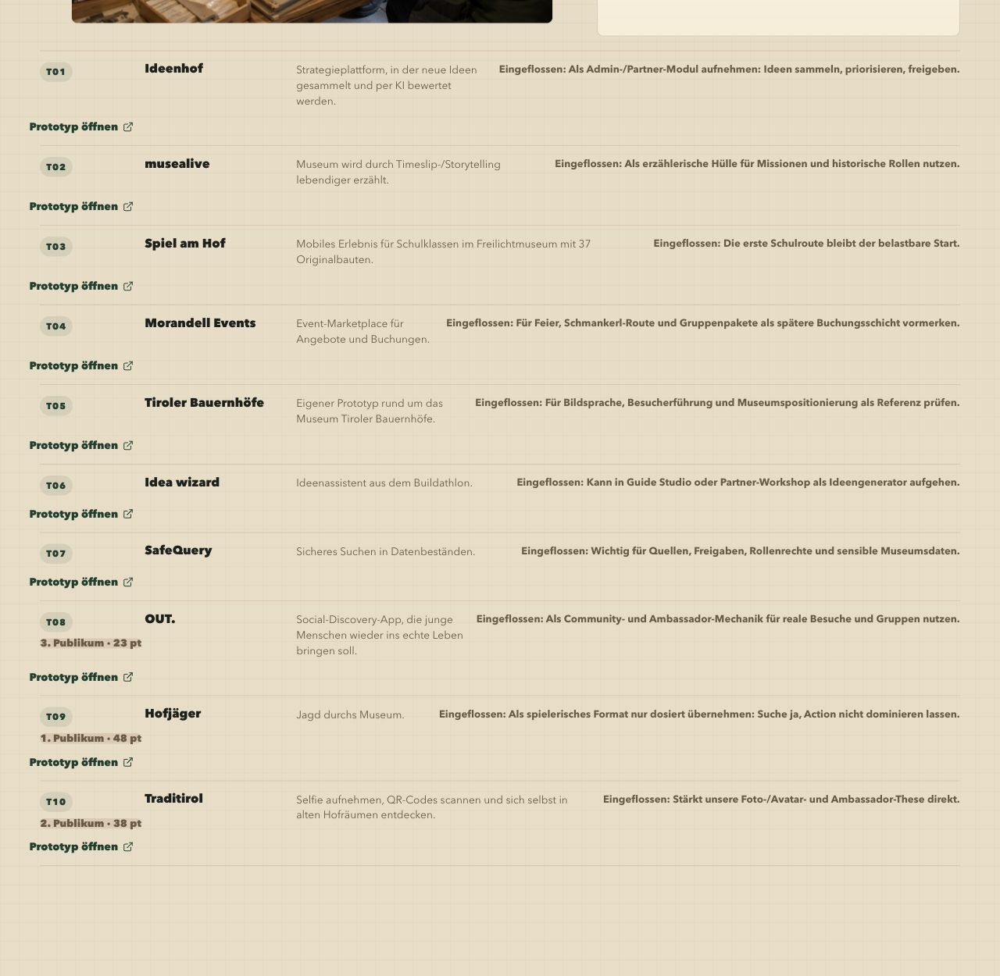

**Bewertung**  
Der Block ist als Dokumentation nuetzlich, aber als UI sehr dicht. Viele Eintraege, kleine Texte und gleichartige Zeilen erschweren die Orientierung. Fuer eine oeffentliche Website oder Pitchseite ist das eher Appendix-Material.

**Ueberarbeitungsschritte**

1. **P1:** Grid nicht voll sichtbar als Hauptblock zeigen, sondern zusammenfassen.
2. **P2:** Drei bis vier repraesentative Projekte als Karten hervorheben.
3. **P2:** Vollstaendige Liste in eine ausklappbare Tabelle oder separate Dokumentationsseite verschieben.
4. **P3:** Filter oder Kategorien ergaenzen, falls die Liste sichtbar bleiben muss.

## 16 - Avatar Lab

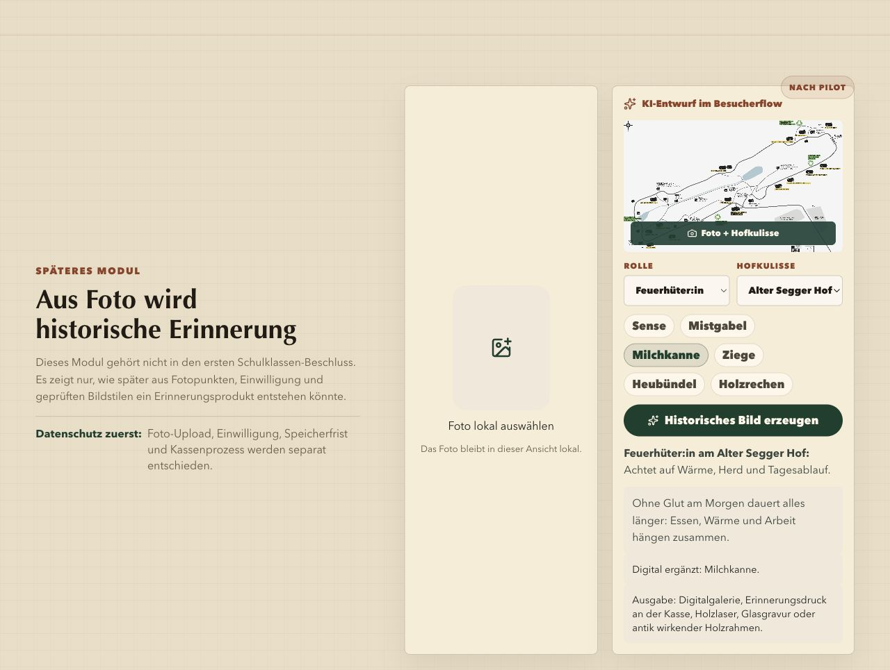

**Bewertung**  
Das Avatar Lab ist ein spannender, eigenstaendiger Produktaspekt. Die Idee passt zu Vermittlung und Personalisierung. Die aktuelle Darstellung wirkt aber noch wie ein Feature-Konzept, nicht wie ein fertiges Erlebnis. Der Upload-Platzhalter ist sehr leer.

**Ueberarbeitungsschritte**

1. **P2:** Einen konkreten Vorher/Nachher-Fall zeigen: Foto, Stil, fertiger Avatar.
2. **P2:** Upload-Bereich mit Beispielzustand fuellen, damit er weniger leer wirkt.
3. **P2:** Rollen des Avatars im Museumsbesuch erklaeren: Begleiter, Figur, Belohnung oder Missiongeber.
4. **P3:** Rechte Inspirationskarten reduzieren und staerker auf Auswahl/Ergebnis trimmen.

## 17 - Prozess

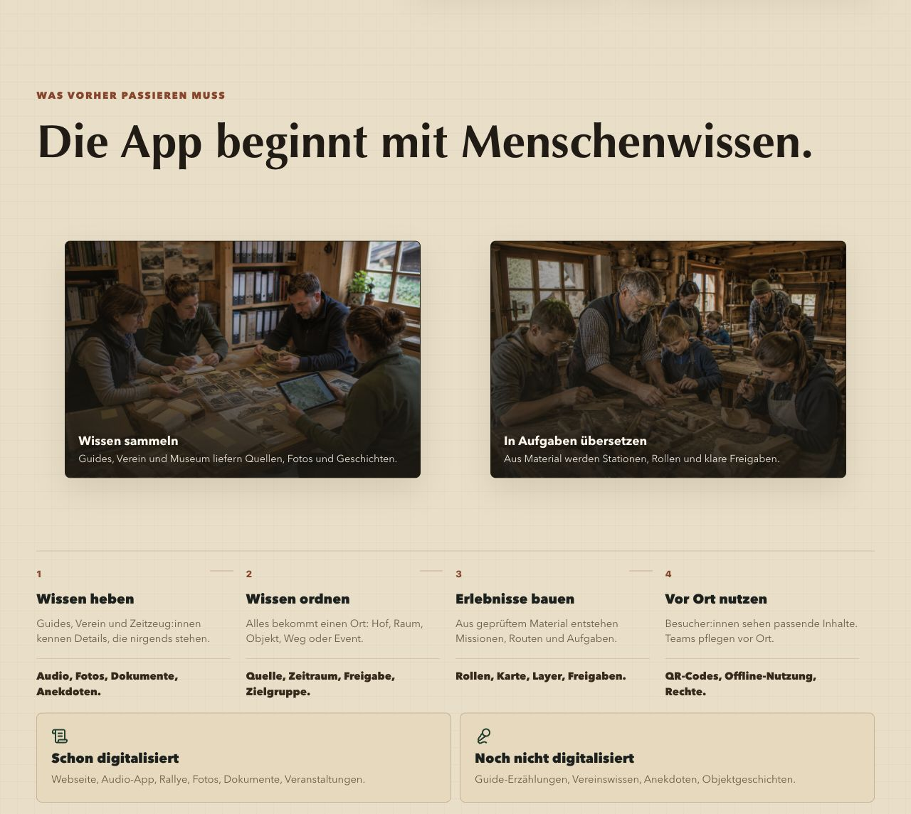

**Bewertung**  
Der Prozessbereich ist klar und ruhig. Er passt gut zur Projektsteuerung und macht den Ablauf nachvollziehbar. Visuell ist er sauber, aber erneut relativ statisch. Nach den vielen vorherigen Abschnitten sollte er besonders knapp und entscheidungsorientiert sein.

**Ueberarbeitungsschritte**

1. **P2:** Prozess als 4-Schritt-Roadmap mit Datum/Zeithorizont darstellen.
2. **P2:** Pro Schritt ein klares Deliverable nennen.
3. **P2:** Entscheiderrelevante Gates hervorheben: Freigabe, Test, Auswertung, Skalierung.
4. **P3:** Textlaengen reduzieren und Statusmarker einsetzen.

## 18 - Guide Studio

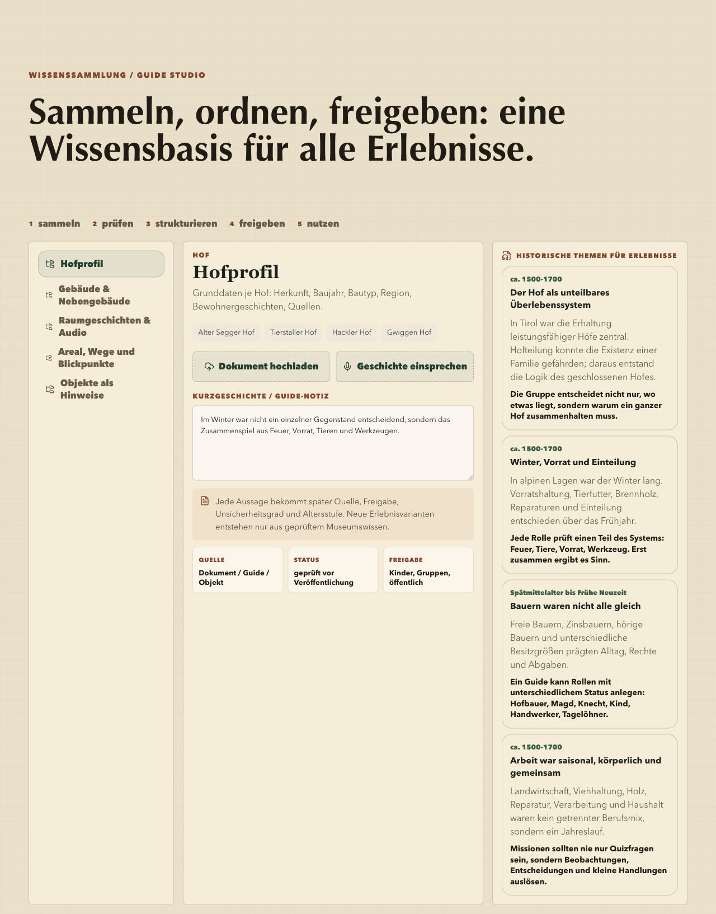

**Bewertung**  
Der Block ist produktnah und vermittelt, dass Inhalte redaktionell steuerbar sind. Das ist fuer Museen sehr wichtig. Die grossen Panels wirken aber teilweise leer und das Interface liest sich noch eher als Konzeptansicht denn als echtes Werkzeug.

**Ueberarbeitungsschritte**

1. **P2:** Guide Studio als echtes Dashboard verdichten: Liste, Vorschau, Bearbeiten, Veröffentlichen.
2. **P2:** Ein konkretes Beispielobjekt durchgehend zeigen.
3. **P2:** Leere Flaechen in den Panels reduzieren und mit realistischen Daten fuellen.
4. **P3:** Statuschips und Aktionen klarer voneinander trennen.

## 19 - Erweiterungen

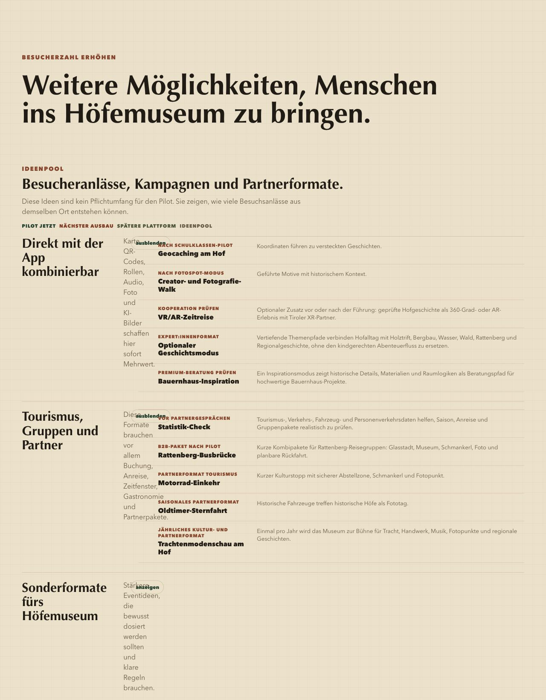

**Bewertung**  
Hier liegt der deutlichste UI-Fehler. Links ueberlagern sich Beschriftungen und Inhalte; einzelne Texte wirken gequetscht und laufen visuell in Tabellenzeilen hinein. Inhaltlich ist der Block relevant, aber zu dicht und aktuell nicht praesentationstauglich.

**Ueberarbeitungsschritte**

1. **P1:** Layout-Ueberlagerung sofort beheben: Spaltenbreiten, Grid-Breakpoints und Textumbruch pruefen.
2. **P1:** Linke Seitenlabels entfernen oder in normale Abschnittsueberschriften umwandeln.
3. **P2:** Erweiterungen in Kategorien gliedern: Besucher, Redaktion, Betrieb, Skalierung.
4. **P2:** Tabellenartige Listen in Karten oder Akkordeons umwandeln.
5. **P3:** Nur die wichtigsten 5 bis 7 Erweiterungen sichtbar zeigen, Rest als Backlog.

## 20 - Kosten / Entscheidung

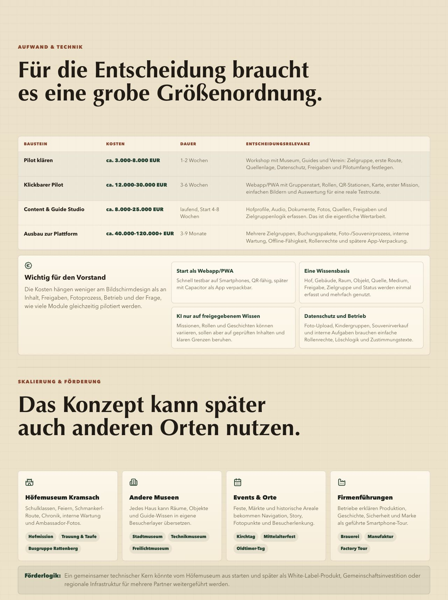

**Bewertung**  
Der Kostenblock ist klar, ruhig und fuer Entscheider gut geeignet. Er passt als Abschluss, weil er Budget, Risiko und naechsten Schritt zusammenfuehrt. Visuell ist er weiterhin dokumentenhaft, aber an dieser Stelle ist das weniger problematisch. Es fehlt noch eine staerkere finale Entscheidungsklammer.

**Ueberarbeitungsschritte**

1. **P2:** Eine sehr klare Abschlussbox ergaenzen: empfohlene Option, Betrag, Ergebnis, Frist.
2. **P2:** Kostenpositionen nach Muss/Kann/Spaeter trennen.
3. **P2:** Den finalen CTA sichtbarer machen: "Pilot freigeben" oder "Workshop terminieren".
4. **P3:** Tabellenoptik leicht auflockern, ohne die Seriositaet zu verlieren.

## Empfohlene Arbeitsreihenfolge

1. **P1 Layoutfix:** Block 19 reparieren und responsive pruefen.
2. **P1 Verdichtung:** Bloecke 03, 04, 13, 15 und 19 radikal kuerzen oder teilweise in Appendix/Akkordeons verschieben.
3. **P2 Produktnarrativ:** Bloecke 07, 08, 09, 10 und 18 frueher und staerker als roter Faden einsetzen.
4. **P2 Designsystem:** Headline-Groessen, Kartenraster, Bildhoehen, Abstaende und Akzentfarben ueber alle Bloecke vereinheitlichen.
5. **P2 Entscheidungsseite schaerfen:** Anfang und Ende so umbauen, dass Nutzen, Risiko, Aufwand und Freigabe in unter 60 Sekunden verstanden werden.
6. **P3 Feinschliff:** Microcopy, CTA-Texte, Bildcaptions, Hover-/Focus-Zustaende und mobile Karten-/Map-Darstellung pruefen.

## Konkrete Zielstruktur fuer eine staerkere Version

1. **Hero:** Worum geht es, warum jetzt, was soll entschieden werden?
2. **Produktbeweis:** Clickdummy, Phone-Prototyp, Karte und Mission sofort sichtbar machen.
3. **Pilotlogik:** Was wird getestet, mit welchem Aufwand, mit welchem Ergebnis?
4. **Museumswert:** Kontext, Sammlung und Vermittlung nur so tief wie noetig.
5. **Betrieb:** Guide Studio, Module, Prozess und Erweiterbarkeit.
6. **Entscheidung:** Kosten, Optionen, Empfehlung und naechster Schritt.

