# Hack am Hof - UI/UX Block-Review, neue Runde

Datum: 2026-05-25 22:34  
URL: http://127.0.0.1:5173  
Viewport: Desktop, 1280 x 720  
Umfang: 23 Screenshots von oben nach unten

## Kurzfazit

Die aktuelle Version ist klarer als der vorherige Stand. Der Hero sagt jetzt direkter, worueber entschieden werden soll. Die Pilot-Beschlussbox ist stark, die Produktbloecke mit Phone, Clickdummy, Karte, Missionen und Guide Studio tragen das Projekt sichtbar besser. Das Erscheinungsbild passt weiterhin gut zum Gesamtprojekt: warm, museumshaft, ruhig, serioes und eher kuratiert als werblich.

Die Hauptprobleme bleiben aber strukturell:

1. **P1: Erweiterungen-Block reparieren.** In Block 22 ueberlagern sich Labels, Spalten und Listeninhalte sichtbar. Das ist nicht praesentationsreif.
2. **P1: Lange Dokumentbloecke kuerzen.** Kontextgrid, Buildathon-Grid und Erweiterungen lesen sich noch wie Arbeitsdokumente.
3. **P2: Produktbeweis frueher und haeufiger als visuellen Anker nutzen.** Clickdummy, Karte, Mission Generator und Guide Studio sind die staerksten Teile.
4. **P2: Typografische Gewichtung weiter beruhigen.** Viele sehr grosse Serif-Headlines konkurrieren ueber die lange Seite.
5. **P2: Gesamtseite verkuerzen.** Mit rund 26.200 px Seitenhoehe ist die Seite fuer eine Entscheidungs-/Pitchseite deutlich zu lang.

## Screenshot-Uebersicht

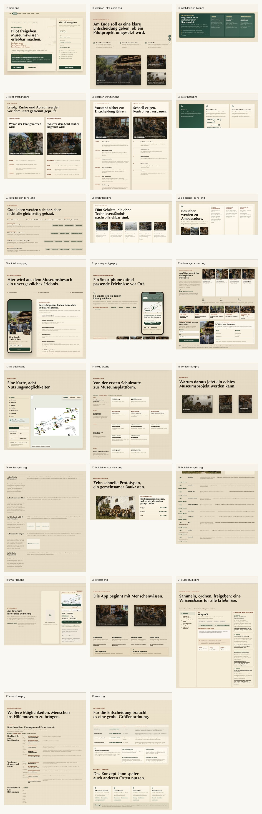

## Prioritaeten

**P1 - Vor Praesentation beheben**  
Sichtbare Layoutfehler, ueberlange oder nicht scannbare Entscheidungsbloecke.

**P2 - Wichtig fuer Wirkung und UX**  
Informationsarchitektur, Blickfuehrung, Verdichtung, Produktnarrativ, visuelle Hierarchie.

**P3 - Feinschliff**  
Microcopy, Abstaende, Bildzuschnitte, CTA-Texte, responsive Details.

## 01 - Hero / Einstieg

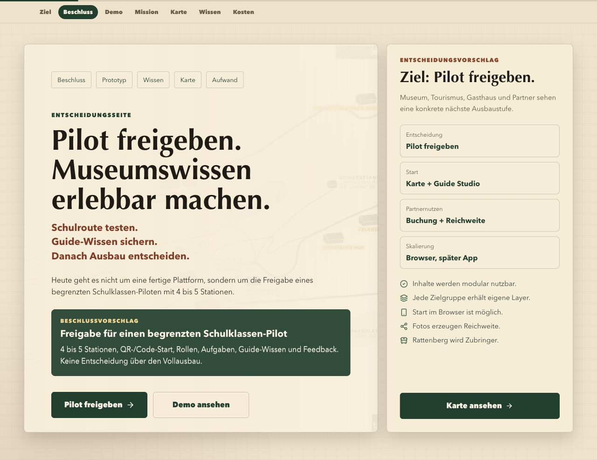

**Bewertung**  
Der Hero funktioniert jetzt deutlich besser als Entscheidungsseite. "Pilot freigeben" ist klar, die rechte Beschlusskarte macht Ziel, Start, Partnernutzen und Skalierung greifbar. Stil, Farben und Typografie passen gut zum Museumsprojekt. Der Einstieg wirkt serioes und foerderfaehig, nicht wie eine generische App-Landingpage.

**Ueberarbeitungsschritte**

1. **P2:** Primaeren CTA und zweiten CTA noch klarer trennen: "Pilot freigeben" als Entscheidung, "Demo ansehen" als Nachweis.
2. **P2:** Rechte Karte etwas kompakter machen, damit der Blick schneller zur Hauptaussage zurueckfindet.
3. **P3:** Die kleinen Tabs oben im Hero optisch entweder staerker als Navigation kennzeichnen oder reduzieren, da sie nah an Button-Optik liegen.

## 02 - Entscheidungsintro und Bildbelege

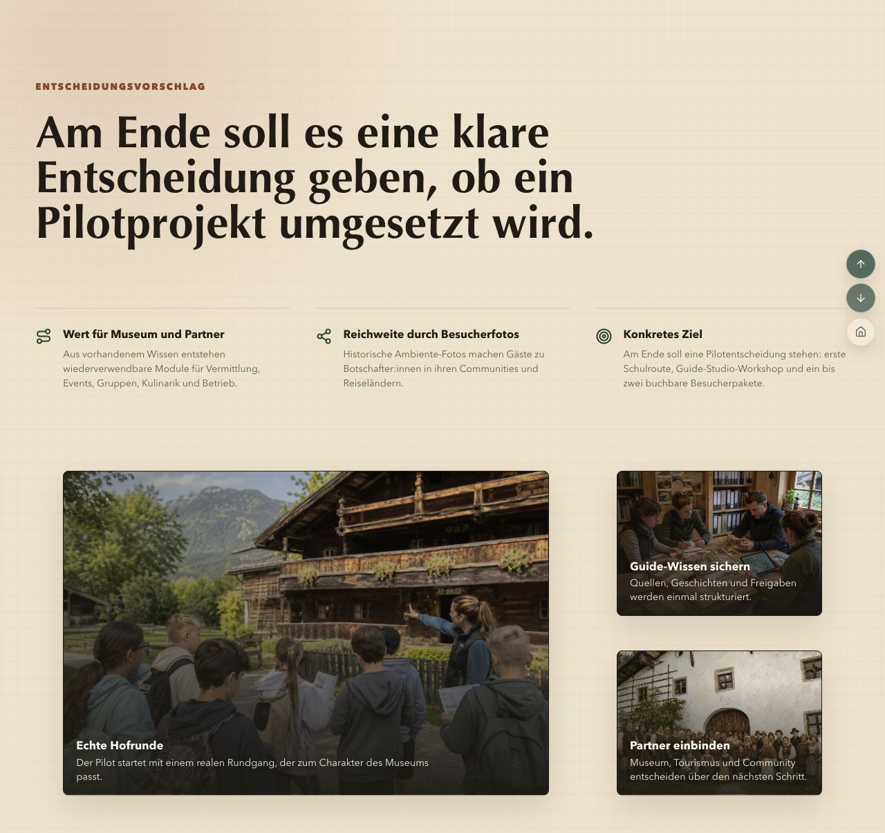

**Bewertung**  
Der Block ist atmosphaerisch stark und gibt dem Beschluss eine glaubwuerdige Grundlage. Die drei Nutzenpunkte oben sind gut, die Bildbelege darunter wirken passend und hochwertig. Die floating Scroll-Controls rechts schneiden optisch etwas in den Block hinein und wirken fuer eine Praesentationsseite leicht stoerend.

**Ueberarbeitungsschritte**

1. **P2:** Drei Nutzenpunkte noch staerker als Entscheidungslogik formulieren: Wert, Reichweite, Ziel.
2. **P2:** Bildbelege mit einer knappen Beschlussrelevanz versehen, nicht nur mit Atmosphaere.
3. **P3:** Floating Scroll-Controls kleiner, transparenter oder nur bei Interaktion sichtbar machen.

## 03 - Pilot-Beschlussbox

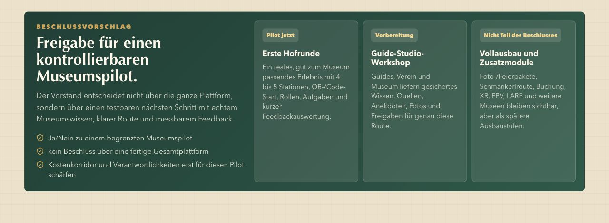

**Bewertung**  
Sehr starker Block. Er grenzt Pilot, Vorbereitung und Nicht-Beschluss sauber voneinander ab. Das ist exakt passend fuer Vorstand, Verein und Partner, weil es Angst vor einem zu grossen App-Projekt nimmt. Die dunkle Flaeche wirkt verbindlich und hebt den Beschluss gut hervor.

**Ueberarbeitungsschritte**

1. **P2:** Die drei rechten Karten gleich hoch lassen, aber die Inhalte noch mehr als "Jetzt / Danach / Nicht jetzt" formulieren.
2. **P2:** Unter dem Block eine knappe Beschlussfrage ergaenzen: "Soll dieser begrenzte Pilot freigegeben werden?"
3. **P3:** Die Karten im dunklen Bereich etwas mehr Innenabstand oder kleinere Textgroesse geben, damit sie luftiger wirken.

## 04 - Erfolgskriterien und Risikobegrenzung

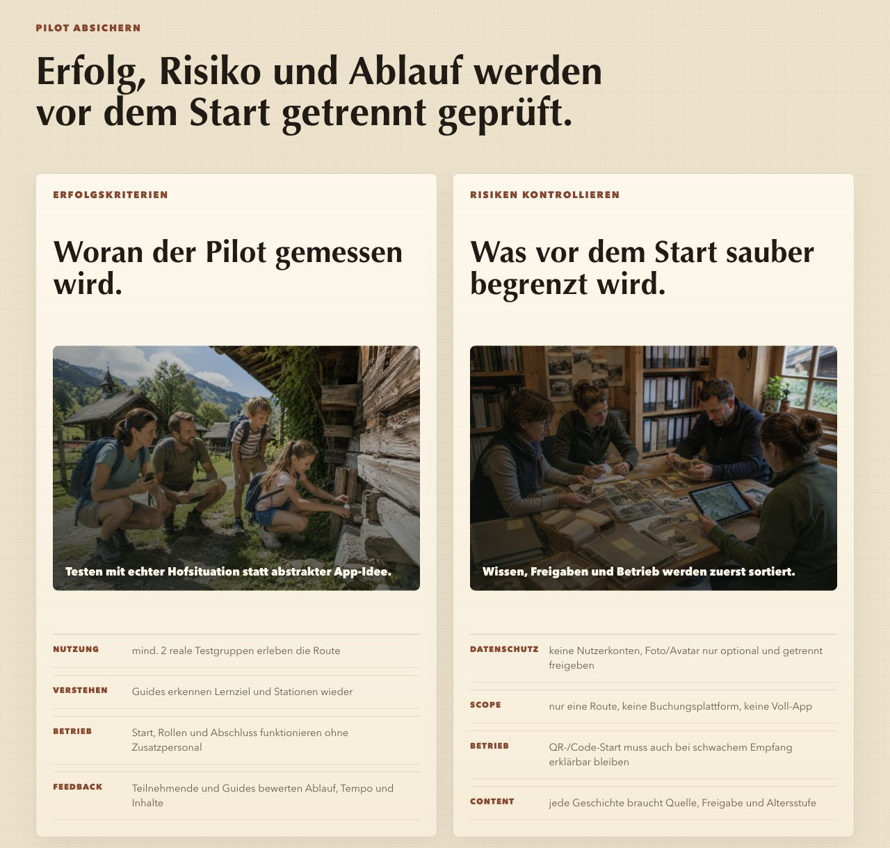

**Bewertung**  
Der Block ist inhaltlich sehr passend: links Erfolg, rechts Begrenzung. Das ist fuer eine Pilotentscheidung genau richtig. Visuell ist er besser als eine reine Tabelle, aber weiterhin relativ textlastig. Die Fotos helfen, muessen aber noch staerker als Belege und nicht als Dekoration wirken.

**Ueberarbeitungsschritte**

1. **P2:** Pro Karte eine visuelle Statuszeile einfuehren: "Messbar", "Begrenzt", "Vor Pilot pruefen".
2. **P2:** Die Listen auf maximal vier Punkte pro Seite begrenzen.
3. **P3:** Bildcaptions noch konkreter machen: "So wird getestet" und "So wird Risiko reduziert".

## 05 - Vorstands-Workflow

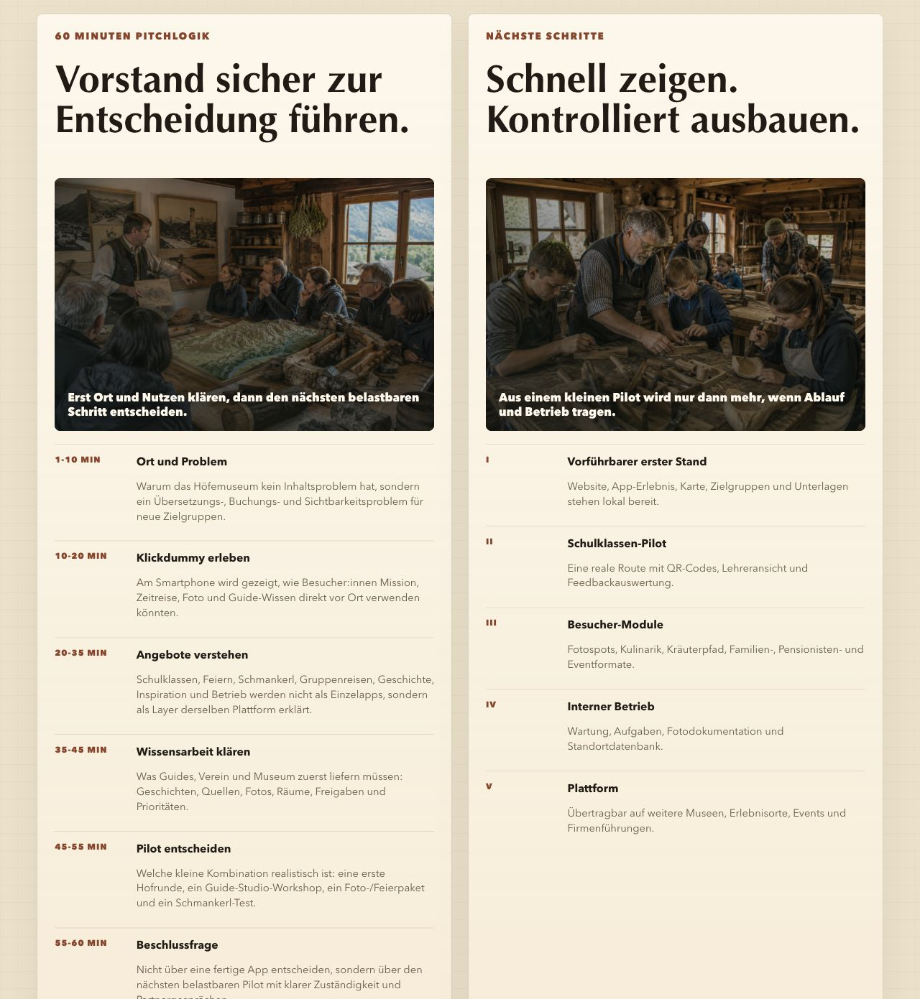

**Bewertung**  
Inhaltlich sehr stark, aber noch zu lang fuer schnelles Erfassen. Die zwei Spalten "Pitchlogik" und "Naechste Schritte" sind nachvollziehbar, die vielen Zeilen erzeugen jedoch Dokumentcharakter. Als interner Ablaufplan gut, als Website-Block zu schwer.

**Ueberarbeitungsschritte**

1. **P1:** Auf 4 Kernschritte reduzieren: Problem, Demo, Pilotumfang, Beschluss.
2. **P2:** Die 60-Minuten-Logik als horizontale Timeline oder kompakter Stepper darstellen.
3. **P2:** Detailtexte in einen ausklappbaren Bereich oder in den MD-/PDF-Anhang verschieben.
4. **P3:** Bilder etwas weniger abgedunkelt zeigen, damit der Block lebendiger wirkt.

## 06 - Kernthese

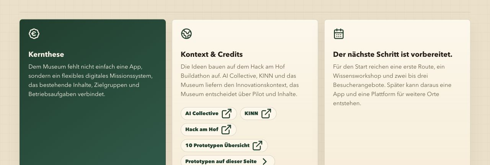

**Bewertung**  
Der Block verdichtet gut, warum das Projekt nicht "nur App" ist. Die drei Karten sind ruhig und passend. Der Block ist aber visuell eher ein Zwischenfazit als ein eigenstaendiger Erlebnisabschnitt.

**Ueberarbeitungsschritte**

1. **P2:** Die Kernthese als markanten Merksatz staerker hervorheben.
2. **P2:** "Kontext & Credits" und "naechster Schritt" mit konkreten Ergebnissen verbinden.
3. **P3:** Eine kleine Produktminiatur oder ein Icon pro Karte ergaenzen, um die reine Textwirkung zu reduzieren.

## 07 - Ideenbewertung

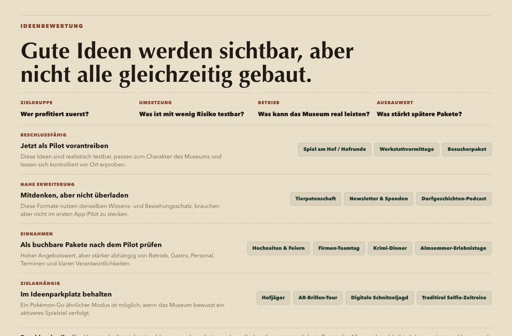

**Bewertung**  
Die Bewertungslogik ist relevant, aber die Tabelle wirkt kleinteilig. Der Block zeigt, dass Ideen nicht wahllos gebaut werden, was sehr gut zur Pilotlogik passt. UX-seitig fehlt ein klarer Fokus auf die Empfehlung.

**Ueberarbeitungsschritte**

1. **P1:** Sichtbar eine Top-Empfehlung hervorheben: "Pilot jetzt" und "nicht jetzt".
2. **P2:** Die Bewertungsmatrix auf wenige Zeilen kuerzen oder als Entscheidungsfilter gestalten.
3. **P2:** Farbcodierung fuer Phasen deutlicher machen, ohne das ruhige Design zu brechen.
4. **P3:** Tabellenlinien und kleine Labels reduzieren, damit der Block weniger spreadsheetartig wirkt.

## 08 - Pitch Track

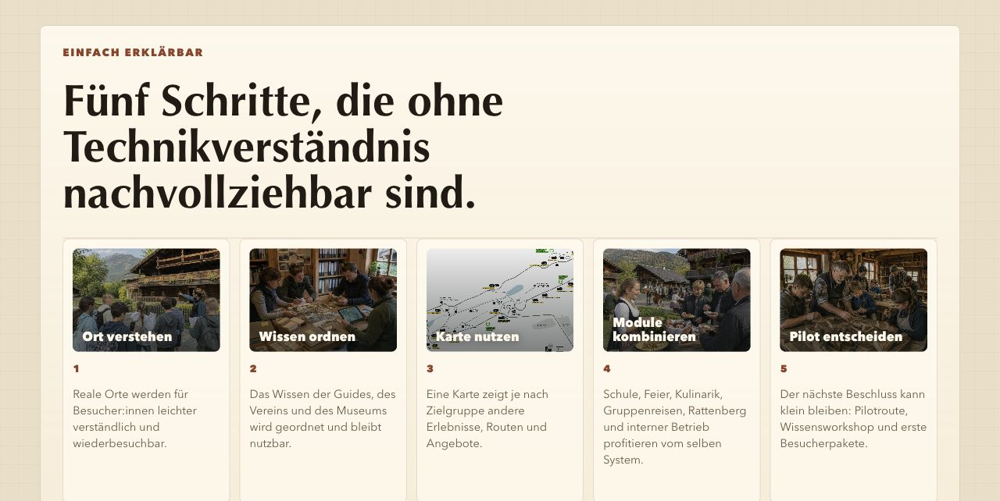

**Bewertung**  
Der Block ist deutlich scannbarer als laengere Textpassagen. Die fuenf Schritte sind gut nachvollziehbar und die kleinen Bilder geben Orientierung. Passung zum Gesamtprojekt ist hoch, weil Nicht-Techniker abgeholt werden.

**Ueberarbeitungsschritte**

1. **P2:** Die fuenf Schritte als echte Journey mit Pfeil-/Progression darstellen.
2. **P2:** Pro Schritt nur eine aktive Aussage: "Ort verstehen", "Wissen nutzen", "Mission erleben" usw.
3. **P3:** Bildkarten etwas groesser oder gleichmaessiger beschneiden, damit die visuelle Reihe hochwertiger wirkt.

## 09 - Ambassador Panel

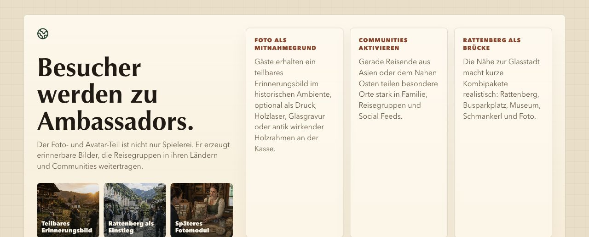

**Bewertung**  
Die Ambassador-Idee passt gut, weil sie Reichweite und Erinnerung verbindet. Der Block ist aber sehr textlastig und erklaert viel, statt ein klares Beispiel zu zeigen. Fuer die Gesamtwirkung waere ein konkretes Besucherbild oder ein Beispiel-Output staerker.

**Ueberarbeitungsschritte**

1. **P2:** Einen konkreten Ambassador-Use-Case zeigen: Foto, Erinnerung, Teilen, Rueckkehr.
2. **P2:** Die rechten Textspalten auf 2 bis 3 Nutzenpunkte reduzieren.
3. **P3:** Mehr visuelle Verbindung zum Avatar-/Fotomodul herstellen.

## 10 - App Clickdummy

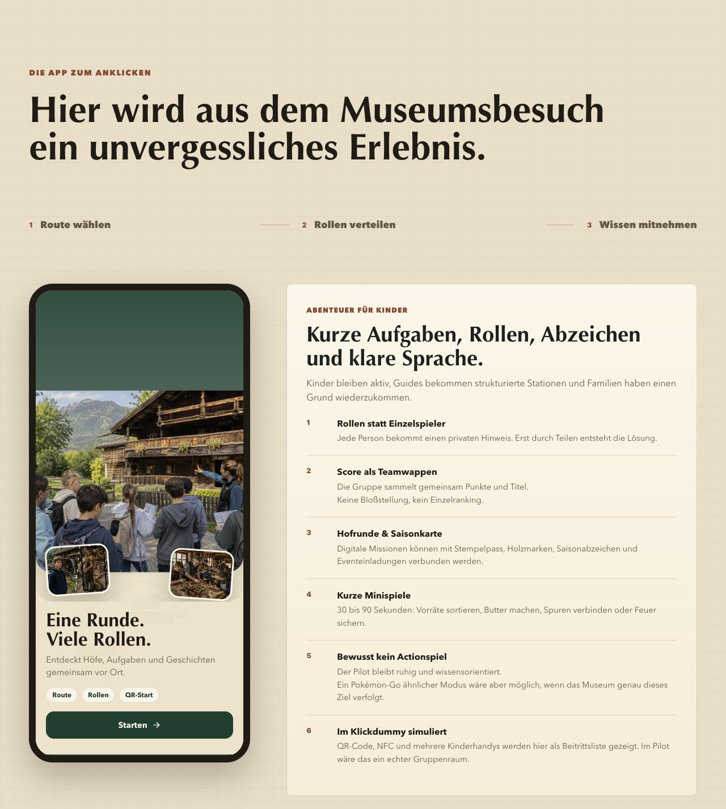

**Bewertung**  
Einer der staerksten Produktbloecke. Der Phone-Screen plus klare Rollen-/Aufgabenlogik macht das Projekt greifbar. UI/UX und Gesamtprojekt passen hier sehr gut zusammen: Kindgerechte Aktivitaet, ruhige Wissensvermittlung, keine uebertriebene Gamification.

**Ueberarbeitungsschritte**

1. **P2:** Diesen Block noch frueher anteasern oder direkt nach dem Hero verlinken.
2. **P2:** Rechte Liste auf 4 wichtigste Prinzipien kuerzen.
3. **P3:** Im Phone-Screen einen zweiten Zustand zeigen, etwa "Station geoeffnet" oder "Teamabschluss".

## 11 - Phone Prototype

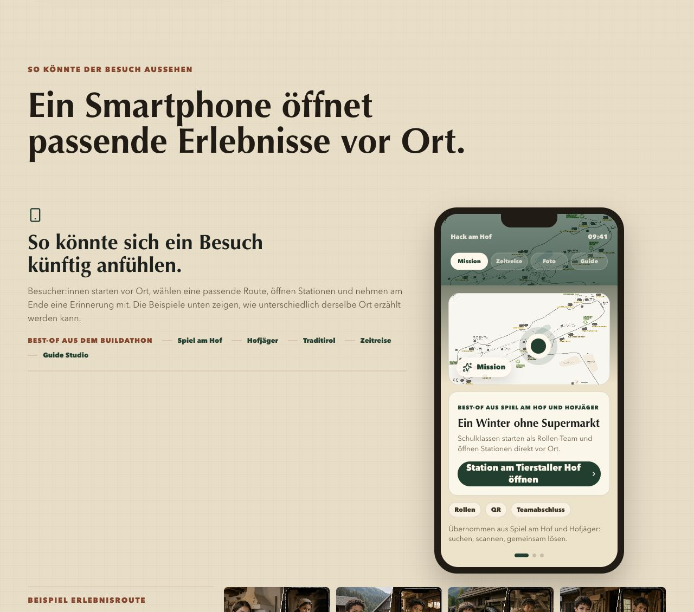

**Bewertung**  
Der Smartphone-Prototyp bringt App-Wirkung und Museumsort gut zusammen. Der linke Text erklaert den Ansatz, rechts wird das Produkt sichtbar. Die grosse leere Mitte verleiht Ruhe, nimmt dem Block aber auch etwas Dynamik. Der untere Rand deutet naechste Inhalte an, was als Uebergang funktioniert.

**Ueberarbeitungsschritte**

1. **P2:** Mehr Produktzustand im Phone zeigen: Mission, Foto, Guide, Abschluss.
2. **P2:** Linke Textspalte weiter verkuerzen und den Nutzen staerker in 3 Punkten fassen.
3. **P3:** Die Tabs "Best-of aus dem Buildathon" optisch aktiver oder klickbarer gestalten.

## 12 - Mission Generator

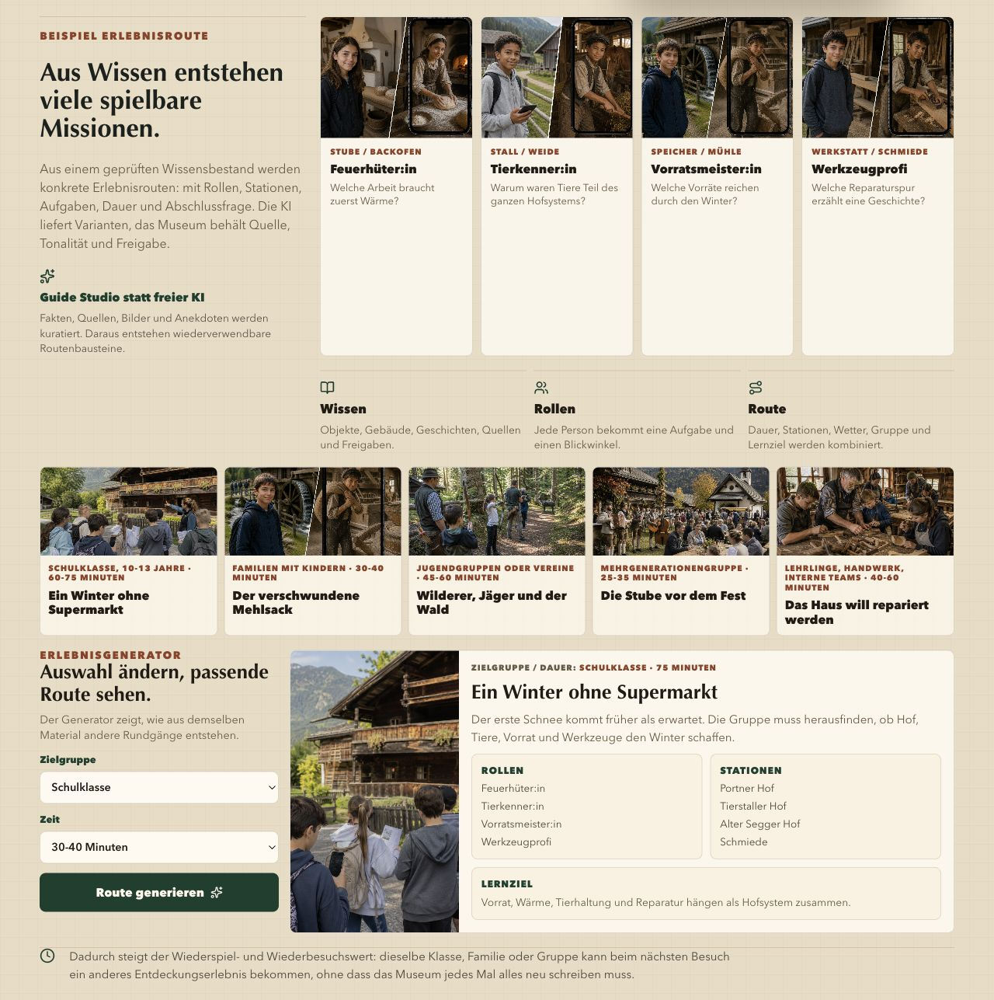

**Bewertung**  
Sehr relevant fuer das Projekt, aber der dichteste Produktblock. Die Idee "aus Wissen entstehen Missionen" ist stark. Gleichzeitig konkurrieren viele Karten, Bilder, Filter und Detailfelder. Fuer Kinder-UX und Museumsvermittlung sollte dieser Block spielerischer und weniger verwaltungslastig wirken.

**Ueberarbeitungsschritte**

1. **P1:** Sichtbare Kartenanzahl reduzieren oder in Carousel/Tabs aufteilen.
2. **P2:** Einen Beispielpfad hervorheben: Wissen -> Rolle -> Route -> Aufgabe.
3. **P2:** Das Formular links staerker als Generator-Fokus inszenieren.
4. **P3:** Tag- und Metadatenzeilen optisch zuruecknehmen, damit die Story im Vordergrund steht.

## 13 - Karten-Demo

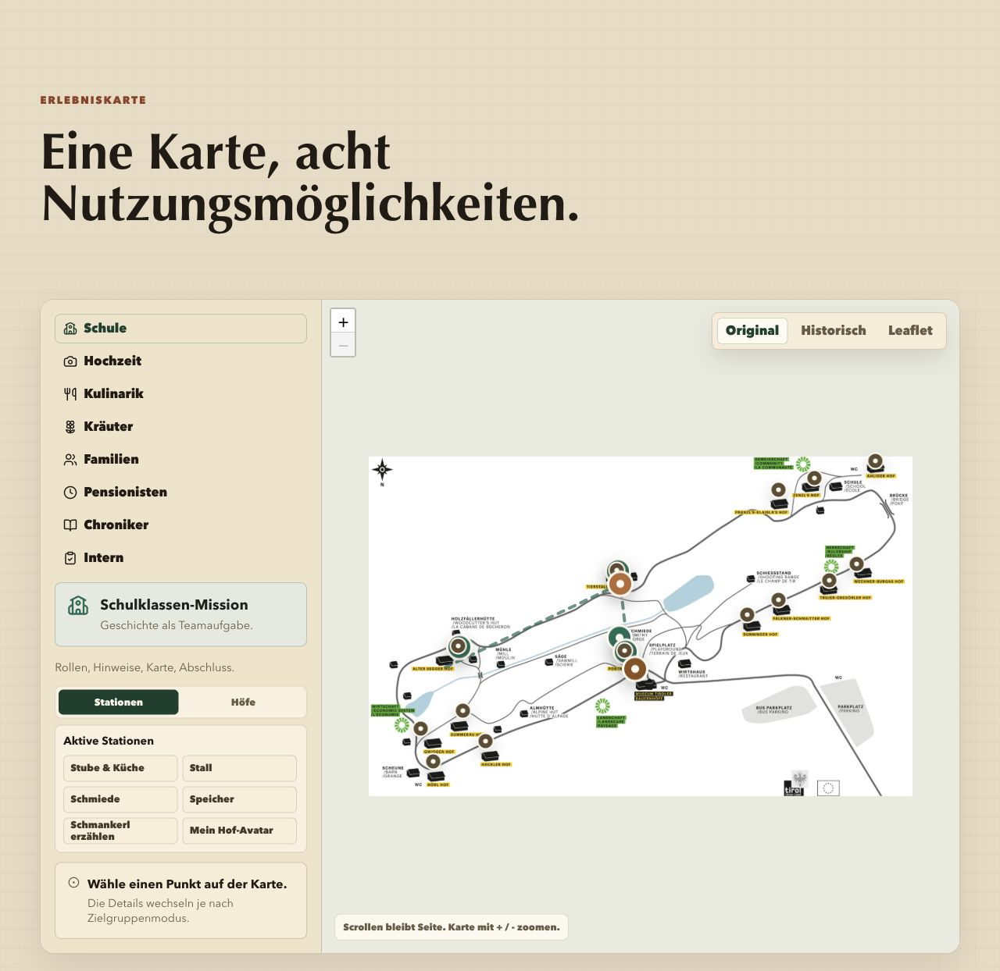

**Bewertung**  
Der Block bleibt einer der wichtigsten Nachweise. Die Karte zeigt sofort, dass die App ortsbezogen gedacht ist. Sidebar, Layer und Stationen sind verstaendlich. Der Block passt sehr gut zum Museumsprojekt und sollte als Produktanker erhalten bleiben.

**Ueberarbeitungsschritte**

1. **P2:** Ueber der Karte eine sehr kurze Use-Case-Zeile ergaenzen: "Schulklasse waehlt Route, Stationen oeffnen Aufgaben."
2. **P2:** Sidebar noch kompakter machen, damit die Karte mehr Raum bekommt.
3. **P3:** Die Layer-Tabs oben rechts visuell mit der linken Zielgruppenliste verbinden.

## 14 - Module und Phasen

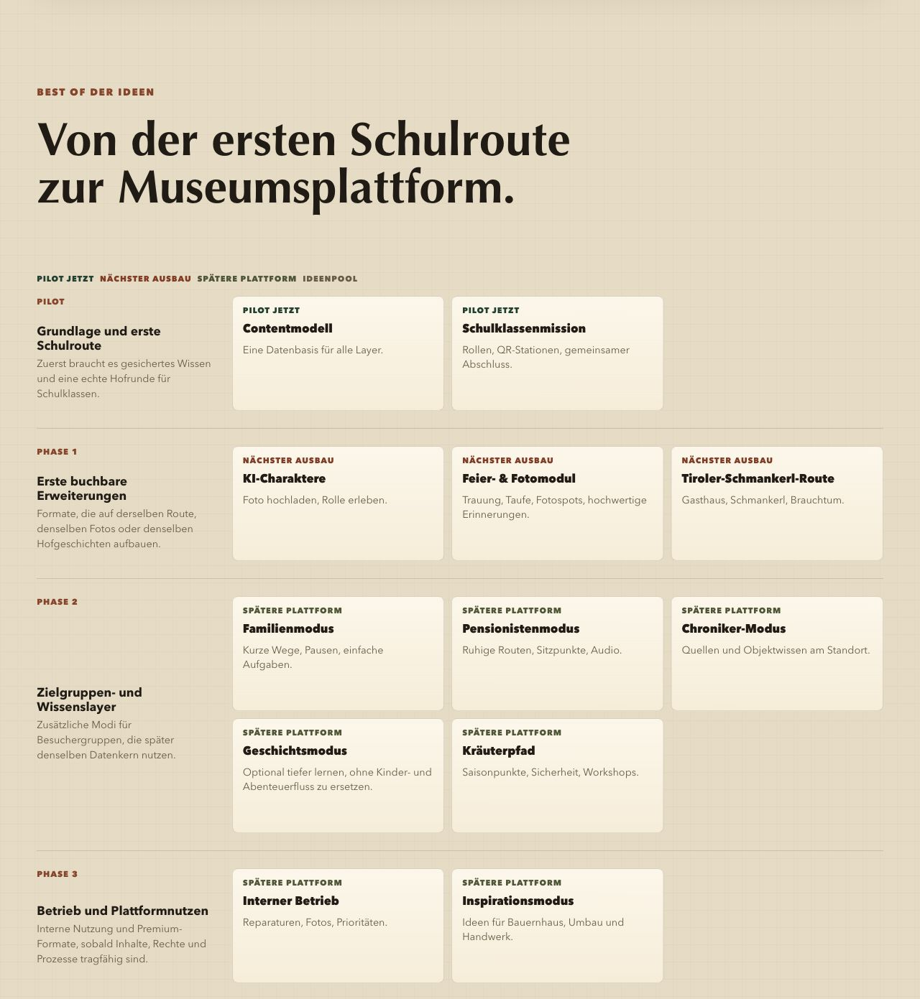

**Bewertung**  
Der Bereich ist jetzt deutlich besser strukturiert: Pilot, Phase 1, Phase 2 und Phase 3 sind klar. Das passt sehr gut zur Gesamtlogik, weil der Vorstand sieht, was jetzt klein beginnt und spaeter skalieren kann. Visuell bleibt es ein Kartenraster, aber es ist sinnvoller als vorher.

**Ueberarbeitungsschritte**

1. **P2:** "Pilot jetzt" noch staerker markieren, damit sofort klar ist, was beschlossen werden soll.
2. **P2:** Spaetere Plattformmodule optisch etwas zuruecknehmen, damit sie nicht wie gleichzeitiger Umfang wirken.
3. **P3:** Pro Phase ein kleines Ergebnislabel ergaenzen: "Beschluss", "Angebot", "Zielgruppen", "Betrieb".

## 15 - Kontextintro

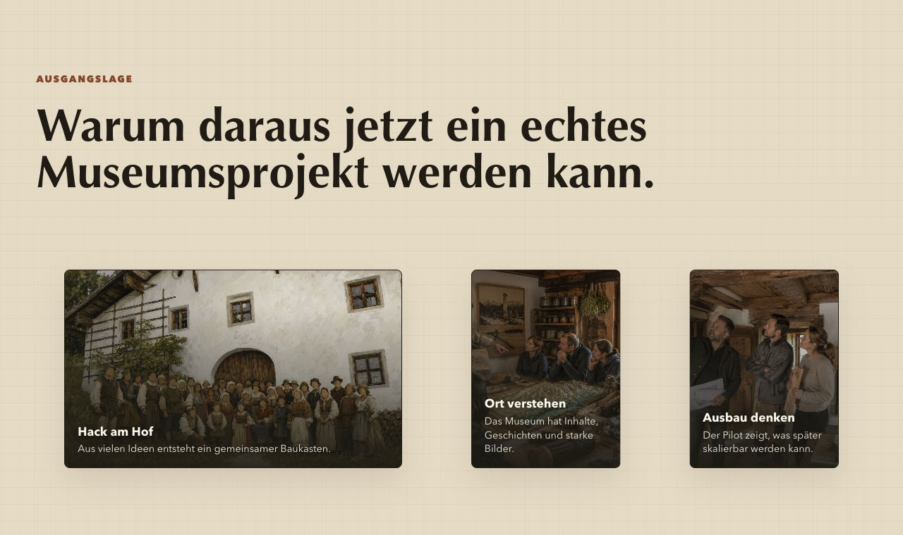

**Bewertung**  
Der Block bringt den kulturellen Kontext gut zurueck und ist visuell passend. Drei Bildkarten reichen aus und wirken hochwertig. Als Uebergang ist der Abschnitt gut, sollte aber nicht zu viel Raum gegenueber den Produktbloecken einnehmen.

**Ueberarbeitungsschritte**

1. **P2:** Kontextintro kurz halten und direkt mit "warum Pilot" verbinden.
2. **P3:** Captions staerker auf Erkenntnis formulieren, nicht nur beschreibend.
3. **P3:** Pruefen, ob der Block vor oder nach den Produktnachweisen besser wirkt.

## 16 - Kontextgrid

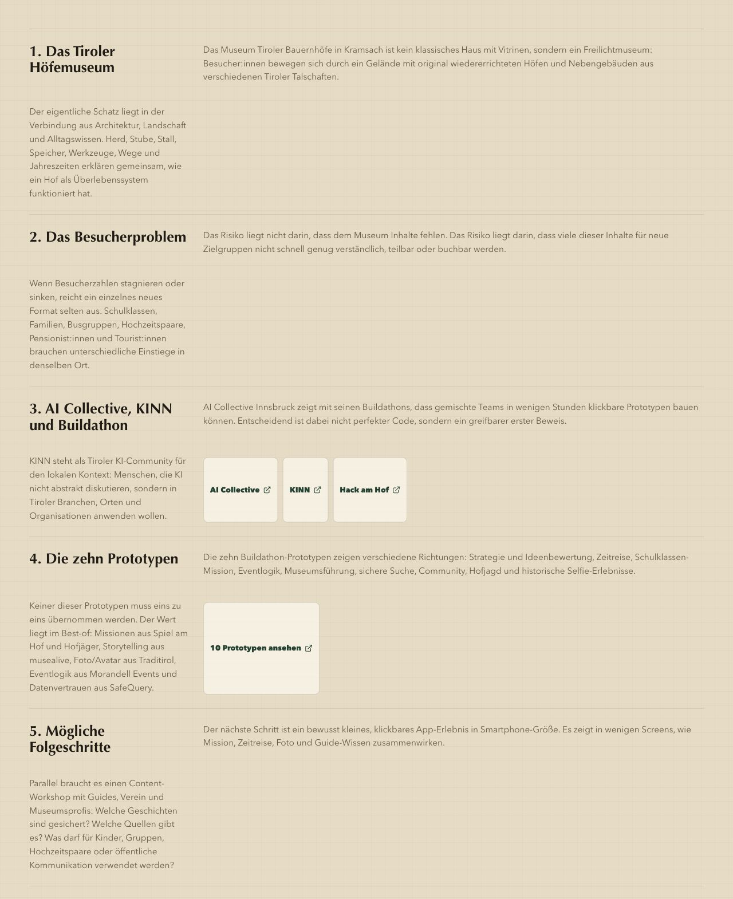

**Bewertung**  
Inhaltlich nuetzlich, aber als Website-UI zu dokumentenhaft. Viel Text, lange Zeilen und breite horizontale Flaechen bremsen das Lesen. Der Block passt als Hintergrund, aber nicht als zentraler Screen in einer Entscheidungsseite.

**Ueberarbeitungsschritte**

1. **P1:** Kontextgrid stark kuerzen oder als Appendix/Akkordeon auslagern.
2. **P2:** Nur 3 Kernargumente sichtbar lassen: Ort, Besucherproblem, naechster Schritt.
3. **P2:** Links und Prototypenhinweise als kleine Belege statt grosse Leer-Karten darstellen.
4. **P3:** Zeilenlaengen reduzieren, damit Text besser lesbar wird.

## 17 - Buildathon Uebersicht

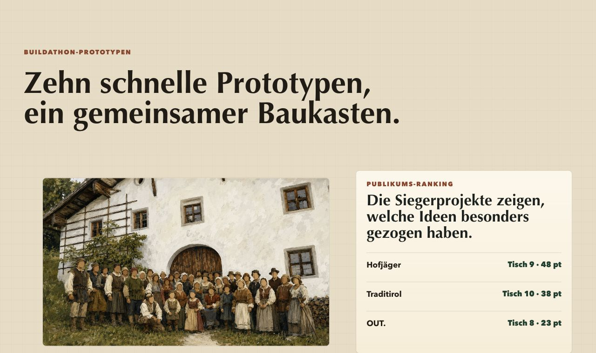

**Bewertung**  
Der Buildathon-Block gibt Glaubwuerdigkeit und zeigt, dass die Idee aus realen Prototypen entstanden ist. Das Foto und Ranking sind hilfreich. Der Zusammenhang zur jetzigen Pilotempfehlung koennte noch klarer sein.

**Ueberarbeitungsschritte**

1. **P2:** Direkt sagen, welche 2 bis 3 Erkenntnisse aus dem Buildathon in den Pilot eingeflossen sind.
2. **P2:** Ranking nicht als Hauptargument wirken lassen, sondern als Beleg fuer Resonanz.
3. **P3:** Die Foto-/Ranking-Komposition etwas kompakter machen.

## 18 - Buildathon Grid

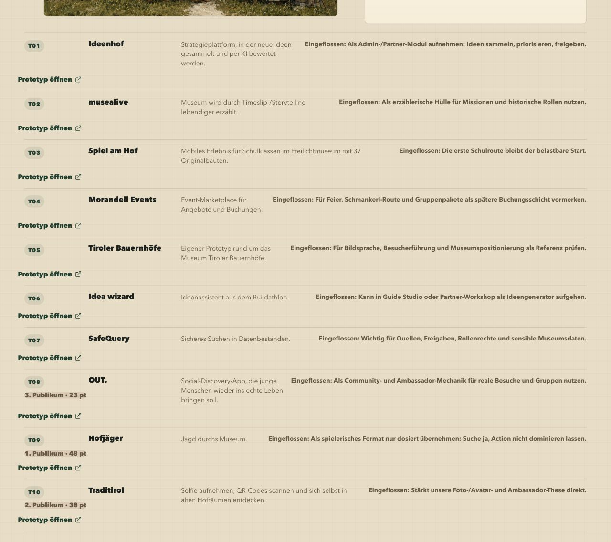

**Bewertung**  
Die Liste ist als Dokumentation sinnvoll, aber als UI weiterhin zu dicht. Viele Zeilen, kleine Texte und wiederholte "Prototyp oeffnen"-Links erzeugen Verwaltungscharakter. Dieser Block sollte nicht die Hauptseite dominieren.

**Ueberarbeitungsschritte**

1. **P1:** Auf 3 bis 5 wichtigste Prototypen kuerzen und Rest auslagern.
2. **P2:** Die Spalte "Eingeflossen" als zentrale Erkenntnis verwenden, die Projektbeschreibung kuerzen.
3. **P2:** Links "Prototyp oeffnen" nur beim Hover oder in Detailansicht anzeigen.
4. **P3:** Wenn Tabelle bleibt, Kopfzeile und Spaltenstruktur deutlicher machen.

## 19 - Avatar Lab

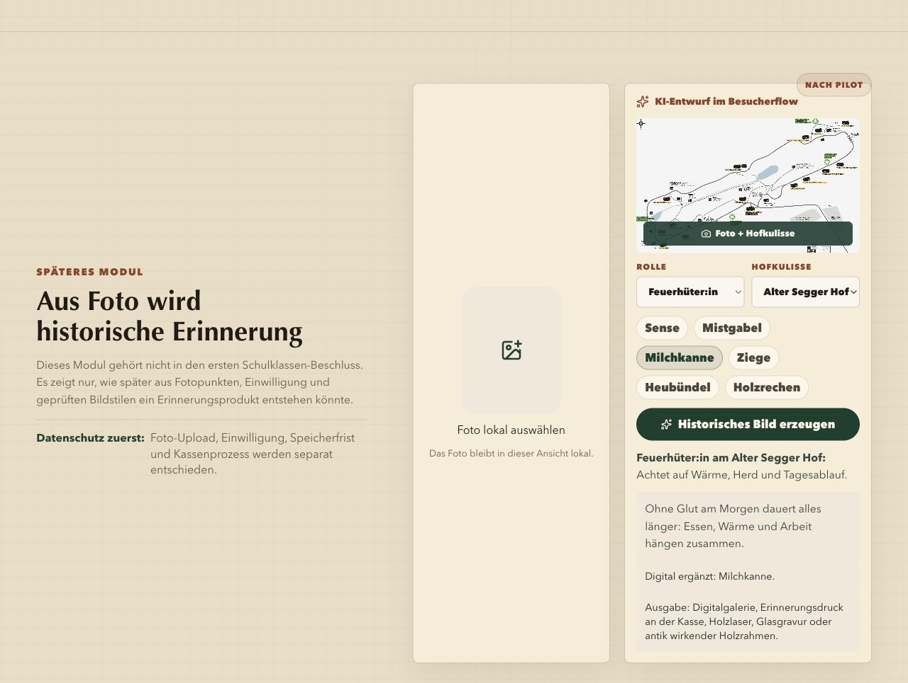

**Bewertung**  
Das Avatar Lab ist thematisch reizvoll und passt zur Ambassador-/Erinnerungslogik. Aktuell wirkt der mittlere Upload-Bereich aber sehr leer, waehrend rechts die eigentliche Idee erklaert wird. Der Block ist als spaeteres Modul korrekt markiert, sollte aber mit einem konkreteren Ergebnisbild arbeiten.

**Ueberarbeitungsschritte**

1. **P2:** Einen Beispielzustand zeigen: Foto gewaehlt -> historisches Bild als Output.
2. **P2:** Upload-Flaeche kleiner oder mit Beispiel-Placeholder füllen.
3. **P2:** Datenschutzhinweis sichtbarer, aber kuerzer formulieren.
4. **P3:** Rechts die vielen Chips reduzieren und Ergebnisnutzen staerker hervorheben.

## 20 - Prozess

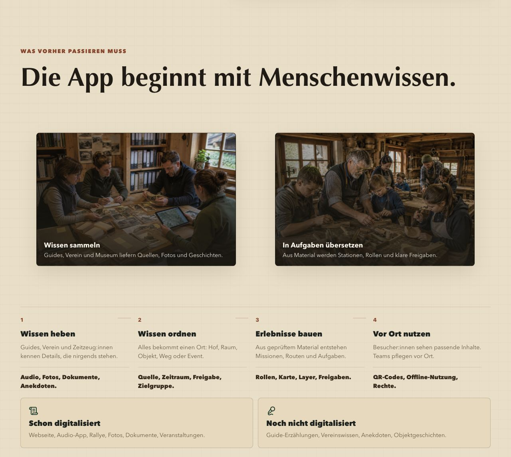

**Bewertung**  
Der Prozessblock wirkt ruhig und glaubwuerdig. Er macht klar, dass Menschenwissen die Grundlage ist. Die Bilder helfen, aber die unteren Prozesspunkte sind noch recht dokumentarisch. Passung zum Projekt ist hoch, weil es die Rolle von Guides, Verein und Museum sichtbar macht.

**Ueberarbeitungsschritte**

1. **P2:** Prozess als echte 4-Schritt-Roadmap mit Ergebnis pro Schritt darstellen.
2. **P2:** "Schon digitalisiert" und "Noch nicht digitalisiert" staerker als Statuscheck zeigen.
3. **P3:** Untere Texte kuerzen und mehr visuelle Marker einsetzen.

## 21 - Guide Studio

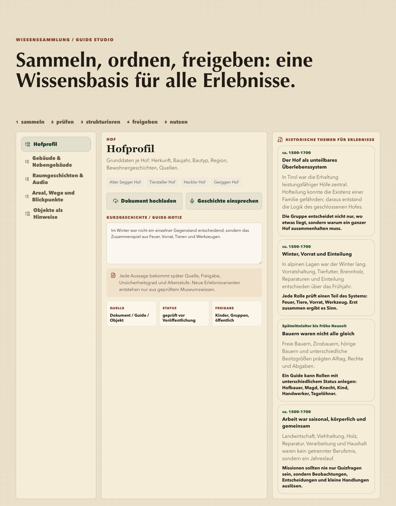

**Bewertung**  
Das Guide Studio ist ein sehr wichtiger Block, weil er zeigt, dass die App auf gepflegtem Wissen basiert. Der Block wirkt deutlich glaubwuerdiger als reine App-Screens. Gleichzeitig ist die rechte Spalte sehr textreich und die mittlere Arbeitsflaeche etwas leer.

**Ueberarbeitungsschritte**

1. **P2:** Ein konkretes Hofprofil einmal komplett durchspielen: Quelle, Freigabe, Mission.
2. **P2:** Rechte Themenkarten kuerzen oder als scrollbare Detailspalte darstellen.
3. **P2:** Mittlere Arbeitsflaeche mit realistischeren Daten fuellen.
4. **P3:** Linke Navigation etwas schmaler oder kompakter setzen.

## 22 - Erweiterungen

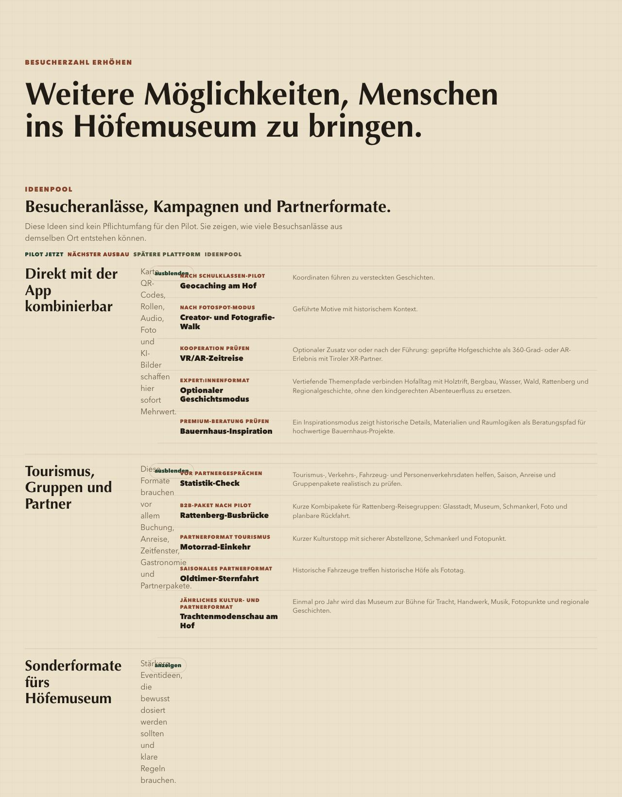

**Bewertung**  
Das ist der kritischste Block. Es gibt sichtbare Ueberlagerungen: kleine Labels wie "ausblenden" liegen in Textspalten, linke Kategorien und Fliesstext werden gequetscht, Tabelleninhalte laufen optisch ineinander. Inhaltlich sind die Ideen relevant, aber der Block ist im aktuellen Zustand nicht praesentationsfaehig.

**Ueberarbeitungsschritte**

1. **P1:** Layout sofort reparieren: Grid-Spalten, absolute Labels, Zeilenhoehen und Textumbruch pruefen.
2. **P1:** Die seitlichen Langtexte entfernen oder oberhalb jeder Kategorie als normale Kurzbeschreibung setzen.
3. **P1:** "Ausblenden"/"Anzeigen" nicht mitten in Spalten platzieren, sondern als klare Akkordeonsteuerung rechts oder oben.
4. **P2:** Erweiterungen in 3 Akkordeons gliedern: App-nah, Tourismus/Partner, Sonderformate.
5. **P2:** Nur 2 bis 3 Beispiele pro Kategorie offen anzeigen.

## 23 - Kosten und Skalierung

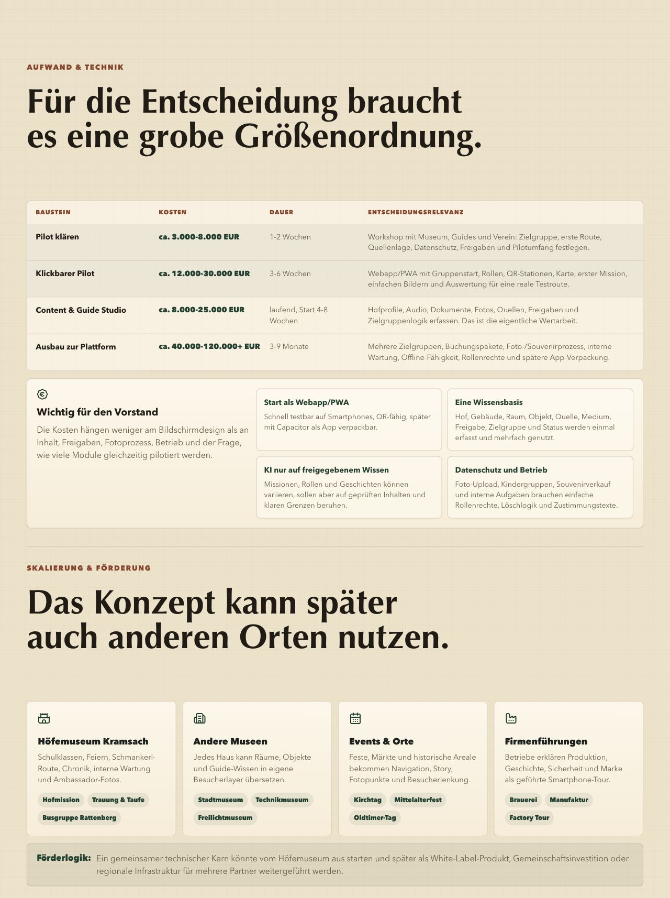

**Bewertung**  
Der Kostenblock ist stark und entscheidungsnah. Er passt gut ans Ende, weil er Aufwand, Technik und Skalierung verknuepft. Die Tabelle ist fuer Entscheider geeignet, bleibt aber visuell sehr sachlich. Die Skalierungskarten darunter zeigen gut, dass der Pilot uebertragbar gedacht ist.

**Ueberarbeitungsschritte**

1. **P2:** Eine klare Empfehlung oberhalb der Tabelle ergaenzen: kleinster sinnvoller Beschluss.
2. **P2:** Kostenposition "Pilot klaeren" und "Klickbarer Pilot" visuell als naechste Entscheidung markieren.
3. **P3:** Foerderlogik unten staerker als Abschlussstatement gestalten.
4. **P3:** Finalen CTA ergaenzen: "Pilotumfang klaeren" oder "Beschlussvorlage vorbereiten".

## Empfohlene naechste Arbeitsschritte

1. **P1 Layoutfix:** Block 22 reparieren und danach Desktop sowie Mobile neu pruefen.
2. **P1 Kuerzung:** Bloecke 16, 18 und 22 aus der Hauptstory herausnehmen oder stark zusammenfassen.
3. **P2 Storyline:** Nach Hero und Beschlussbox frueher zu Clickdummy/Karte/Phone wechseln.
4. **P2 Produktbeweise:** Bloecke 10, 11, 12, 13 und 21 als Kern der Seite behandeln.
5. **P2 Entscheidungspfad:** Bloecke 03, 04, 05, 23 auf einen klaren Beschlussbogen abstimmen.
6. **P3 Feinschliff:** Floating Controls, CTA-Texte, Bildcaptions und Kartenabstaende vereinheitlichen.

## Zielstruktur fuer die naechste Version

1. **Beschluss:** Hero, Ziel, kleiner Pilot, Nicht-Umfang.
2. **Beweis:** Clickdummy, Phone, Karte, Mission Generator.
3. **Absicherung:** Erfolgskriterien, Risiko, Aufwand, Guide Studio.
4. **Kontext:** Museum, Buildathon, Partner nur verdichtet.
5. **Ausbau:** Module und Erweiterungen als kurze Roadmap.
6. **Entscheidung:** Kosten, Empfehlung, naechster konkreter Schritt.

